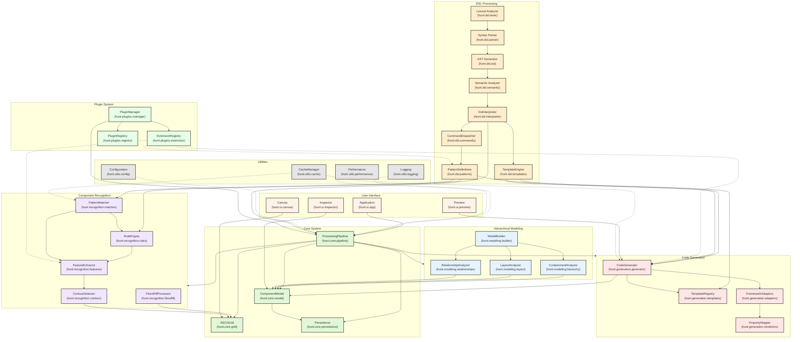

```mermaid
graph TD
    %% Core System Components
    subgraph Core ["Core System"]
        ASCIIGrid["ASCIIGrid\n(hunt.core.grid)"]
        Pipeline["ProcessingPipeline\n(hunt.core.pipeline)"]
        CompModel["ComponentModel\n(hunt.core.model)"]
        Persist["Persistence\n(hunt.core.persistence)"]
    end

    %% DSL System
    subgraph DSL ["DSL Processing"]
        Lexer["Lexical Analyzer\n(hunt.dsl.lexer)"]
        Parser["Syntax Parser\n(hunt.dsl.parser)"]
        ASTGen["AST Generator\n(hunt.dsl.ast)"]
        SemAnalyzer["Semantic Analyzer\n(hunt.dsl.semantic)"]
        DslInterp["DslInterpreter\n(hunt.dsl.interpreter)"]
        CmdDisp["CommandDispatcher\n(hunt.dsl.commands)"]
        PatternDef["PatternDefinitions\n(hunt.dsl.patterns)"]
        TmplEngine["TemplateEngine\n(hunt.dsl.templates)"]
    end

    %% Recognition System
    subgraph Recognition ["Component Recognition"]
        FloodFill["FloodFillProcessor\n(hunt.recognition.floodfill)"]
        Contour["ContourDetector\n(hunt.recognition.contour)"]
        Features["FeatureExtractor\n(hunt.recognition.features)"]
        PatternMatch["PatternMatcher\n(hunt.recognition.matcher)"]
        RuleEngine["RuleEngine\n(hunt.recognition.rules)"]
    end

    %% Modeling System
    subgraph Modeling ["Hierarchical Modeling"]
        ContainAnalyzer["ContainmentAnalyzer\n(hunt.modeling.hierarchy)"]
        LayoutAnalyzer["LayoutAnalyzer\n(hunt.modeling.layout)"]
        RelationAnalyzer["RelationshipAnalyzer\n(hunt.modeling.relationships)"]
        ModelBuilder["ModelBuilder\n(hunt.modeling.builder)"]
    end

    %% Code Generation
    subgraph CodeGen ["Code Generation"]
        Generator["CodeGenerator\n(hunt.generation.generator)"]
        Templates["TemplateRegistry\n(hunt.generation.templates)"]
        Adapters["FrameworkAdapters\n(hunt.generation.adapters)"]
        PropMapper["PropertyMapper\n(hunt.generation.renderers)"]
    end

    %% Plugin System
    subgraph Plugins ["Plugin System"]
        PluginMgr["PluginManager\n(hunt.plugins.manager)"]
        ExtRegistry["ExtensionRegistry\n(hunt.plugins.extension)"]
        PluginReg["PluginRegistry\n(hunt.plugins.registry)"]
    end

    %% UI Components
    subgraph UI ["User Interface"]
        Canvas["Canvas\n(hunt.ui.canvas)"]
        Inspector["Inspector\n(hunt.ui.inspector)"]
        Preview["Preview\n(hunt.ui.preview)"]
        App["Application\n(hunt.ui.app)"]
    end

    %% Utilities
    subgraph Utils ["Utilities"]
        Logger["Logging\n(hunt.utils.logging)"]
        Perf["Performance\n(hunt.utils.performance)"]
        Cache["CacheManager\n(hunt.utils.cache)"]
        Config["Configuration\n(hunt.utils.config)"]
    end

    %% DSL Internal Dependencies
    Lexer --> Parser
    Parser --> ASTGen
    ASTGen --> SemAnalyzer
    SemAnalyzer --> DslInterp
    DslInterp --> CmdDisp
    CmdDisp --> PatternDef
    DslInterp --> TmplEngine

    %% DSL to Recognition Integration
    PatternDef --> PatternMatch
    PatternDef --> RuleEngine
    RuleEngine --> Features

    %% DSL to Code Generation Integration
    TmplEngine --> Templates
    PatternDef --> Generator
    TmplEngine --> Generator

    %% Core Dependencies
    Pipeline --> ASCIIGrid
    Pipeline --> CompModel
    Pipeline --> Persist
    CompModel --> Persist

    %% Recognition Dependencies
    FloodFill --> ASCIIGrid
    Contour --> ASCIIGrid
    Features --> Contour
    PatternMatch --> Features
    PatternMatch --> RuleEngine

    %% Modeling Dependencies
    ContainAnalyzer --> CompModel
    LayoutAnalyzer --> CompModel
    RelationAnalyzer --> CompModel
    ModelBuilder --> ContainAnalyzer
    ModelBuilder --> LayoutAnalyzer
    ModelBuilder --> RelationAnalyzer

    %% Code Generation Dependencies
    Generator --> CompModel
    Generator --> Templates
    Generator --> Adapters
    Adapters --> PropMapper

    %% Plugin System Dependencies
    PluginMgr --> ExtRegistry
    PluginMgr --> PluginReg
    ExtRegistry -.-> PatternDef
    ExtRegistry -.-> Generator
    ExtRegistry -.-> Features

    %% UI Dependencies
    Canvas --> ASCIIGrid
    Inspector --> CompModel
    Preview --> Generator
    App --> Pipeline

    %% Utility Dependencies
    Logger -.-> Pipeline
    Perf -.-> Pipeline
    Cache -.-> PatternMatch
    Cache -.-> Generator
    Config -.-> Pipeline

    %% Cross-cutting Dependencies
    Pipeline --> Recognition
    Pipeline --> Modeling
    Pipeline --> CodeGen
    DslInterp --> Pipeline
    PluginMgr --> Pipeline

    %% Legend
    classDef default fill:#f9f,stroke:#333,stroke-width:2px;
    classDef core fill:#e1f7d5,stroke:#333,stroke-width:2px;
    classDef dsl fill:#ffedcc,stroke:#333,stroke-width:2px;
    classDef recog fill:#f2e6ff,stroke:#333,stroke-width:2px;
    classDef model fill:#e6f3ff,stroke:#333,stroke-width:2px;
    classDef codegen fill:#ffe6e6,stroke:#333,stroke-width:2px;
    classDef plugin fill:#e6ffe6,stroke:#333,stroke-width:2px;
    classDef ui fill:#fff2e6,stroke:#333,stroke-width:2px;
    classDef utils fill:#e6e6e6,stroke:#333,stroke-width:2px;

    %% Apply styles
    class ASCIIGrid,Pipeline,CompModel,Persist core;
    class Lexer,Parser,ASTGen,SemAnalyzer,DslInterp,CmdDisp,PatternDef,TmplEngine dsl;
    class FloodFill,Contour,Features,PatternMatch,RuleEngine recog;
    class ContainAnalyzer,LayoutAnalyzer,RelationAnalyzer,ModelBuilder model;
    class Generator,Templates,Adapters,PropMapper codegen;
    class PluginMgr,ExtRegistry,PluginReg plugin;
    class Canvas,Inspector,Preview,App ui;
    class Logger,Perf,Cache,Config utils;
```
