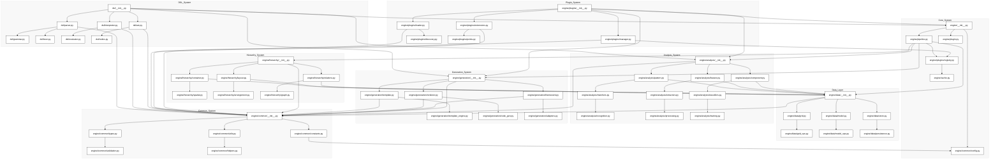

I'll create a comprehensive module dependency graph based on all the reviewed documentation, ensuring clear structure and black text.

```mermaid
%%{init: {'theme': 'base', 'themeVariables': { 'fontFamily': 'arial', 'primaryTextColor': '#000000', 'primaryColor': '#FFFFFF', 'primaryBorderColor': '#000000', 'lineColor': '#000000', 'secondaryColor': '#F8F8F8', 'tertiaryColor': '#F8F8F8'}}}%%

graph TD
    subgraph Core_System
        Engine[engine/__init__.py] --> Pipeline[engine/pipeline.py]
        Engine --> Config[engine/config.py]
        Engine --> Plugin[engine/plugin.py]

        Pipeline --> Registry[engine/registry.py]
        Registry --> Cache[engine/cache.py]
    end

    subgraph DSL_System
        DSL[dsl/__init__.py] --> Parser[dsl/parser.py]
        DSL --> Interpreter[dsl/interpreter.py]
        DSL --> AST[dsl/ast.py]

        Parser --> Grammar[dsl/grammar.py]
        Parser --> Lexer[dsl/lexer.py]
        Interpreter --> Evaluator[dsl/evaluator.py]
        AST --> Nodes[dsl/nodes.py]
    end

    subgraph Data_Layer
        Data[engine/data/__init__.py] --> Grid[engine/data/grid.py]
        Data --> Model[engine/data/model.py]
        Data --> Store[engine/data/store.py]

        Grid --> GridOps[engine/data/grid_ops.py]
        Model --> ModelOps[engine/data/model_ops.py]
        Store --> Persistence[engine/data/persistence.py]
    end

    subgraph Analysis_System
        Analysis[engine/analysis/__init__.py] --> Pattern[engine/analysis/pattern.py]
        Analysis --> Feature[engine/analysis/feature.py]
        Analysis --> Component[engine/analysis/component.py]

        Pattern --> Matchers[engine/analysis/matchers.py]
        Feature --> Extractors[engine/analysis/extractors.py]
        Component --> Classifiers[engine/analysis/classifiers.py]

        Matchers --> Recognition[engine/analysis/recognition.py]
        Extractors --> Processing[engine/analysis/processing.py]
        Classifiers --> Training[engine/analysis/training.py]
    end

    subgraph Hierarchy_System
        Hierarchy[engine/hierarchy/__init__.py] --> Container[engine/hierarchy/container.py]
        Hierarchy --> Layout[engine/hierarchy/layout.py]
        Hierarchy --> Relations[engine/hierarchy/relations.py]

        Container --> Spatial[engine/hierarchy/spatial.py]
        Layout --> Arrangement[engine/hierarchy/arrangement.py]
        Relations --> Graph[engine/hierarchy/graph.py]
    end

    subgraph Generation_System
        Generation[engine/generation/__init__.py] --> Template[engine/generation/template.py]
        Generation --> Renderer[engine/generation/renderer.py]
        Generation --> Framework[engine/generation/framework.py]

        Template --> TemplateEngine[engine/generation/template_engine.py]
        Renderer --> CodeGen[engine/generation/code_gen.py]
        Framework --> Adapters[engine/generation/adapters.py]
    end

    subgraph Common_System
        Common[engine/common/__init__.py] --> Types[engine/common/types.py]
        Common --> Utils[engine/common/utils.py]
        Common --> Constants[engine/common/constants.py]

        Types --> Validation[engine/common/validation.py]
        Utils --> Helpers[engine/common/helpers.py]
        Constants --> Config[engine/common/config.py]
    end

    subgraph Plugin_System
        Plugins[engine/plugins/__init__.py] --> Manager[engine/plugins/manager.py]
        Plugins --> Loader[engine/plugins/loader.py]
        Plugins --> Extensions[engine/plugins/extensions.py]

        Manager --> Registry[engine/plugins/registry.py]
        Loader --> Discovery[engine/plugins/discovery.py]
        Extensions --> Points[engine/plugins/points.py]
    end

    %% Core Dependencies
    Pipeline --> Data
    Pipeline --> Analysis
    Pipeline --> Hierarchy
    Pipeline --> Generation

    %% DSL Dependencies
    Parser --> Common
    Interpreter --> Common
    AST --> Common

    %% Analysis Dependencies
    Pattern --> Data
    Feature --> Data
    Component --> Data

    %% Hierarchy Dependencies
    Container --> Data
    Layout --> Data
    Relations --> Data

    %% Generation Dependencies
    Template --> Common
    Renderer --> Common
    Framework --> Common

    %% Plugin Dependencies
    Manager --> Common
    Loader --> Common
    Extensions --> Common

    %% Shared Dependencies
    Data --> Common
    Analysis --> Common
    Hierarchy --> Common
    Generation --> Common

    %% DSL Integration
    DSL --> Engine
    DSL --> Generation
    DSL --> Analysis

    %% Plugin Integration
    Plugins --> Engine
    Plugins --> Generation
    Plugins --> Analysis
```
