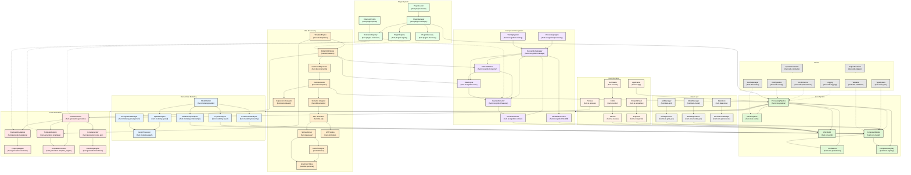

```mermaid
graph TD
%% Core System Components
subgraph Core ["Core System"]
ASCIIGrid["ASCIIGrid\n(hunt.core.grid)"]
Pipeline["ProcessingPipeline\n(hunt.core.pipeline)"]
CompModel["ComponentModel\n(hunt.core.model)"]
Persist["Persistence\n(hunt.core.persistence)"]
Registry["ComponentRegistry\n(hunt.core.registry)"]
Cache["CacheSystem\n(hunt.core.cache)"]
end

    %% DSL System
    subgraph DSL ["DSL Processing"]
        Lexer["Lexical Analyzer\n(hunt.dsl.lexer)"]
        Parser["Syntax Parser\n(hunt.dsl.parser)"]
        ASTGen["AST Generator\n(hunt.dsl.ast)"]
        SemAnalyzer["Semantic Analyzer\n(hunt.dsl.semantic)"]
        HuntInterp["HuntInterpreter\n(hunt.dsl.interpreter)"]
        CmdDisp["CommandDispatcher\n(hunt.dsl.commands)"]
        PatternDef["PatternDefinitions\n(hunt.dsl.patterns)"]
        TmplEngine["TemplateEngine\n(hunt.dsl.templates)"]
        Grammar["Grammar Rules\n(hunt.dsl.grammar)"]
        Nodes["AST Nodes\n(hunt.dsl.nodes)"]
        Evaluator["Expression Evaluator\n(hunt.dsl.evaluator)"]
    end

    %% Recognition System
    subgraph RecognitionSystem ["Component Recognition"]
        FloodFill["FloodFillProcessor\n(hunt.recognition.floodfill)"]
        Contour["ContourDetector\n(hunt.recognition.contour)"]
        Features["FeatureExtractor\n(hunt.recognition.features)"]
        PatternMatch["PatternMatcher\n(hunt.recognition.matcher)"]
        RuleEngine["RuleEngine\n(hunt.recognition.rules)"]
        RecognitionMgr["RecognitionManager\n(hunt.recognition.manager)"]
        Processing["ProcessingEngine\n(hunt.recognition.processing)"]
        Training["TrainingSystem\n(hunt.recognition.training)"]
    end

    %% Modeling System
    subgraph Modeling ["Hierarchical Modeling"]
        ContainAnalyzer["ContainmentAnalyzer\n(hunt.modeling.hierarchy)"]
        LayoutAnalyzer["LayoutAnalyzer\n(hunt.modeling.layout)"]
        RelationAnalyzer["RelationshipAnalyzer\n(hunt.modeling.relationships)"]
        ModelBuilder["ModelBuilder\n(hunt.modeling.builder)"]
        Spatial["SpatialAnalyzer\n(hunt.modeling.spatial)"]
        Arrangement["ArrangementManager\n(hunt.modeling.arrangement)"]
        Graph["GraphProcessor\n(hunt.modeling.graph)"]
    end

    %% Code Generation
    subgraph Generation ["Code Generation"]
        Generator["CodeGenerator\n(hunt.generation.generator)"]
        Templates["TemplateRegistry\n(hunt.generation.templates)"]
        Adapters["FrameworkAdapters\n(hunt.generation.adapters)"]
        PropMapper["PropertyMapper\n(hunt.generation.renderers)"]
        TemplateEngine["TemplateProcessor\n(hunt.generation.template_engine)"]
        CodeGenCore["CoreGenerator\n(hunt.generation.code_gen)"]
        Renderers["RenderingEngine\n(hunt.generation.renderers)"]
    end

    %% Plugin System
    subgraph Plugins ["Plugin System"]
        PluginMgr["PluginManager\n(hunt.plugins.manager)"]
        ExtRegistry["ExtensionRegistry\n(hunt.plugins.extension)"]
        PluginReg["PluginRegistry\n(hunt.plugins.registry)"]
        Discovery["PluginDiscovery\n(hunt.plugins.discovery)"]
        Loader["PluginLoader\n(hunt.plugins.loader)"]
        Points["ExtensionPoints\n(hunt.plugins.points)"]
    end

    %% Data Layer
    subgraph Data ["Data Layer"]
        Grid["GridManager\n(hunt.data.grid)"]
        Model["ModelManager\n(hunt.data.model)"]
        Store["DataStore\n(hunt.data.store)"]
        GridOps["GridOperations\n(hunt.data.grid_ops)"]
        ModelOps["ModelOperations\n(hunt.data.model_ops)"]
        Persistence["PersistenceManager\n(hunt.data.persistence)"]
    end

    %% UI Components
    subgraph UI ["User Interface"]
        Canvas["Canvas\n(hunt.ui.canvas)"]
        Inspector["Inspector\n(hunt.ui.inspector)"]
        Preview["Preview\n(hunt.ui.preview)"]
        App["Application\n(hunt.ui.app)"]
        Editor["Editor\n(hunt.ui.editor)"]
        Tools["ToolPalette\n(hunt.ui.tools)"]
        Properties["PropertyPanel\n(hunt.ui.properties)"]
    end

    %% Utilities
    subgraph Utils ["Utilities"]
        Logger["Logging\n(hunt.utils.logging)"]
        Perf["Performance\n(hunt.utils.performance)"]
        CacheUtil["CacheManager\n(hunt.utils.cache)"]
        Config["Configuration\n(hunt.utils.config)"]
        Types["TypeSystem\n(hunt.utils.types)"]
        Validation["Validator\n(hunt.utils.validation)"]
        Helpers["HelperFunctions\n(hunt.utils.helpers)"]
        Constants["SystemConstants\n(hunt.utils.constants)"]
    end

    %% Core Dependencies
    Pipeline --> ASCIIGrid
    Pipeline --> CompModel
    Pipeline --> Persist
    Pipeline --> Registry
    Pipeline --> Cache
    CompModel --> Registry
    CompModel --> Persist

    %% DSL Dependencies
    Lexer --> Grammar
    Parser --> Lexer
    Parser --> Grammar
    ASTGen --> Parser
    ASTGen --> Nodes
    SemAnalyzer --> ASTGen
    HuntInterp --> SemAnalyzer
    HuntInterp --> Evaluator
    CmdDisp --> HuntInterp
    PatternDef --> CmdDisp
    TmplEngine --> PatternDef

    %% Recognition Dependencies
    RecognitionMgr --> FloodFill
    RecognitionMgr --> Contour
    RecognitionMgr --> Features
    RecognitionMgr --> PatternMatch
    RecognitionMgr --> RuleEngine
    FloodFill --> ASCIIGrid
    Contour --> ASCIIGrid
    Features --> Contour
    PatternMatch --> Features
    PatternMatch --> RuleEngine
    Processing --> RecognitionMgr
    Training --> RecognitionMgr

    %% Modeling Dependencies
    ModelBuilder --> ContainAnalyzer
    ModelBuilder --> LayoutAnalyzer
    ModelBuilder --> RelationAnalyzer
    ModelBuilder --> Spatial
    ContainAnalyzer --> CompModel
    LayoutAnalyzer --> CompModel
    RelationAnalyzer --> CompModel
    Spatial --> Graph
    Arrangement --> Graph

    %% Code Generation Dependencies
    Generator --> Templates
    Generator --> Adapters
    Generator --> TemplateEngine
    Generator --> CodeGenCore
    CodeGenCore --> Renderers
    Adapters --> PropMapper
    Templates --> TemplateEngine

    %% Plugin System Dependencies
    PluginMgr --> ExtRegistry
    PluginMgr --> PluginReg
    PluginMgr --> Discovery
    Loader --> PluginMgr
    Points --> ExtRegistry

    %% Data Layer Dependencies
    Grid --> GridOps
    Model --> ModelOps
    Store --> Persistence
    GridOps --> ASCIIGrid
    ModelOps --> CompModel

    %% UI Dependencies
    App --> Pipeline
    Canvas --> ASCIIGrid
    Inspector --> CompModel
    Preview --> Generator
    Editor --> Canvas
    Tools --> Editor
    Properties --> Inspector

    %% Utility Dependencies
    Logger -.-> Pipeline
    Perf -.-> Pipeline
    CacheUtil -.-> Cache
    Config -.-> Pipeline
    Types -.-> CompModel
    Validation -.-> CompModel
    Helpers -.-> Utils
    Constants -.-> Utils

    %% Cross-cutting Dependencies
    Pipeline --> RecognitionSystem
    Pipeline --> Modeling
    Pipeline --> Generation
    HuntInterp --> Pipeline
    PluginMgr --> Pipeline

    %% Plugin Integration Points
    ExtRegistry -.-> PatternDef
    ExtRegistry -.-> Generator
    ExtRegistry -.-> Features
    ExtRegistry -.-> Templates
    ExtRegistry -.-> Adapters

    %% DSL to Recognition Integration
    PatternDef --> PatternMatch
    PatternDef --> RuleEngine
    RuleEngine --> Features

    %% DSL to Code Generation Integration
    TmplEngine --> Templates
    PatternDef --> Generator

    %% Style Definitions
    classDef default fill:#f9f,stroke:#333,stroke-width:2px,color:#000000;
    classDef core fill:#e1f7d5,stroke:#333,stroke-width:2px,color:#000000;
    classDef dsl fill:#ffedcc,stroke:#333,stroke-width:2px,color:#000000;
    classDef recog fill:#f2e6ff,stroke:#333,stroke-width:2px,color:#000000;
    classDef model fill:#e6f3ff,stroke:#333,stroke-width:2px,color:#000000;
    classDef codegen fill:#ffe6e6,stroke:#333,stroke-width:2px,color:#000000;
    classDef plugin fill:#e6ffe6,stroke:#333,stroke-width:2px,color:#000000;
    classDef ui fill:#fff2e6,stroke:#333,stroke-width:2px,color:#000000;
    classDef utils fill:#e6e6e6,stroke:#333,stroke-width:2px,color:#000000;
    classDef data fill:#f0f0f0,stroke:#333,stroke-width:2px,color:#000000;

    %% Apply styles to all nodes in each subgraph
    class ASCIIGrid,Pipeline,CompModel,Persist,Registry,Cache core;
    class Lexer,Parser,ASTGen,SemAnalyzer,HuntInterp,CmdDisp,PatternDef,TmplEngine,Grammar,Nodes,Evaluator dsl;
    class FloodFill,Contour,Features,PatternMatch,RuleEngine,RecognitionMgr,Processing,Training recog;
    class ContainAnalyzer,LayoutAnalyzer,RelationAnalyzer,ModelBuilder,Spatial,Arrangement,Graph model;
    class Generator,Templates,Adapters,PropMapper,TemplateEngine,CodeGenCore,Renderers codegen;
    class PluginMgr,ExtRegistry,PluginReg,Discovery,Loader,Points plugin;
    class Canvas,Inspector,Preview,App,Editor,Tools,Properties ui;
    class Logger,Perf,CacheUtil,Config,Types,Validation,Helpers,Constants utils;
    class Grid,Model,Store,GridOps,ModelOps,Persistence data;

```
