# Interpreter Overview

```mermaid
graph TD
    %% Core System Components
    subgraph Core ["Core System"]
        ASCIIGrid["ASCIIGrid\n(hunt.core.grid)"]
        Pipeline["ProcessingPipeline\n(hunt.core.pipeline)"]
        CompModel["ComponentModel\n(hunt.core.model)"]
        Persist["Persistence\n(hunt.core.persistence)"]
    end

    %% DSL System
    subgraph DSL ["DSL Processing"]
        Lexer["Lexical Analyzer\n(hunt.dsl.lexer)"]
        Parser["Syntax Parser\n(hunt.dsl.parser)"]
        ASTGen["AST Generator\n(hunt.dsl.ast)"]
        SemAnalyzer["Semantic Analyzer\n(hunt.dsl.semantic)"]
        DslInterp["DslInterpreter\n(hunt.dsl.interpreter)"]
        CmdDisp["CommandDispatcher\n(hunt.dsl.commands)"]
        PatternDef["PatternDefinitions\n(hunt.dsl.patterns)"]
        TmplEngine["TemplateEngine\n(hunt.dsl.templates)"]
    end

    %% Recognition System
    subgraph Recognition ["Component Recognition"]
        FloodFill["FloodFillProcessor\n(hunt.recognition.floodfill)"]
        Contour["ContourDetector\n(hunt.recognition.contour)"]
        Features["FeatureExtractor\n(hunt.recognition.features)"]
        PatternMatch["PatternMatcher\n(hunt.recognition.matcher)"]
        RuleEngine["RuleEngine\n(hunt.recognition.rules)"]
    end

    %% Modeling System
    subgraph Modeling ["Hierarchical Modeling"]
        ContainAnalyzer["ContainmentAnalyzer\n(hunt.modeling.hierarchy)"]
        LayoutAnalyzer["LayoutAnalyzer\n(hunt.modeling.layout)"]
        RelationAnalyzer["RelationshipAnalyzer\n(hunt.modeling.relationships)"]
        ModelBuilder["ModelBuilder\n(hunt.modeling.builder)"]
    end

    %% Code Generation
    subgraph CodeGen ["Code Generation"]
        Generator["CodeGenerator\n(hunt.generation.generator)"]
        Templates["TemplateRegistry\n(hunt.generation.templates)"]
        Adapters["FrameworkAdapters\n(hunt.generation.adapters)"]
        PropMapper["PropertyMapper\n(hunt.generation.renderers)"]
    end

    %% Plugin System
    subgraph Plugins ["Plugin System"]
        PluginMgr["PluginManager\n(hunt.plugins.manager)"]
        ExtRegistry["ExtensionRegistry\n(hunt.plugins.extension)"]
        PluginReg["PluginRegistry\n(hunt.plugins.registry)"]
    end

    %% UI Components
    subgraph UI ["User Interface"]
        Canvas["Canvas\n(hunt.ui.canvas)"]
        Inspector["Inspector\n(hunt.ui.inspector)"]
        Preview["Preview\n(hunt.ui.preview)"]
        App["Application\n(hunt.ui.app)"]
    end

    %% Utilities
    subgraph Utils ["Utilities"]
        Logger["Logging\n(hunt.utils.logging)"]
        Perf["Performance\n(hunt.utils.performance)"]
        Cache["CacheManager\n(hunt.utils.cache)"]
        Config["Configuration\n(hunt.utils.config)"]
    end

    %% DSL Internal Dependencies
    Lexer --> Parser
    Parser --> ASTGen
    ASTGen --> SemAnalyzer
    SemAnalyzer --> DslInterp
    DslInterp --> CmdDisp
    CmdDisp --> PatternDef
    DslInterp --> TmplEngine

    %% DSL to Recognition Integration
    PatternDef --> PatternMatch
    PatternDef --> RuleEngine
    RuleEngine --> Features

    %% DSL to Code Generation Integration
    TmplEngine --> Templates
    PatternDef --> Generator
    TmplEngine --> Generator

    %% Core Dependencies
    Pipeline --> ASCIIGrid
    Pipeline --> CompModel
    Pipeline --> Persist
    CompModel --> Persist

    %% Recognition Dependencies
    FloodFill --> ASCIIGrid
    Contour --> ASCIIGrid
    Features --> Contour
    PatternMatch --> Features
    PatternMatch --> RuleEngine

    %% Modeling Dependencies
    ContainAnalyzer --> CompModel
    LayoutAnalyzer --> CompModel
    RelationAnalyzer --> CompModel
    ModelBuilder --> ContainAnalyzer
    ModelBuilder --> LayoutAnalyzer
    ModelBuilder --> RelationAnalyzer

    %% Code Generation Dependencies
    Generator --> CompModel
    Generator --> Templates
    Generator --> Adapters
    Adapters --> PropMapper

    %% Plugin System Dependencies
    PluginMgr --> ExtRegistry
    PluginMgr --> PluginReg
    ExtRegistry -.-> PatternDef
    ExtRegistry -.-> Generator
    ExtRegistry -.-> Features

    %% UI Dependencies
    Canvas --> ASCIIGrid
    Inspector --> CompModel
    Preview --> Generator
    App --> Pipeline

    %% Utility Dependencies
    Logger -.-> Pipeline
    Perf -.-> Pipeline
    Cache -.-> PatternMatch
    Cache -.-> Generator
    Config -.-> Pipeline

    %% Cross-cutting Dependencies
    Pipeline --> Recognition
    Pipeline --> Modeling
    Pipeline --> CodeGen
    DslInterp --> Pipeline
    PluginMgr --> Pipeline

    %% Legend
    classDef default fill:#f9f,stroke:#333,stroke-width:2px;
    classDef core fill:#e1f7d5,stroke:#333,stroke-width:2px;
    classDef dsl fill:#ffedcc,stroke:#333,stroke-width:2px;
    classDef recog fill:#f2e6ff,stroke:#333,stroke-width:2px;
    classDef model fill:#e6f3ff,stroke:#333,stroke-width:2px;
    classDef codegen fill:#ffe6e6,stroke:#333,stroke-width:2px;
    classDef plugin fill:#e6ffe6,stroke:#333,stroke-width:2px;
    classDef ui fill:#fff2e6,stroke:#333,stroke-width:2px;
    classDef utils fill:#e6e6e6,stroke:#333,stroke-width:2px;

    %% Apply styles
    class ASCIIGrid,Pipeline,CompModel,Persist core;
    class Lexer,Parser,ASTGen,SemAnalyzer,DslInterp,CmdDisp,PatternDef,TmplEngine dsl;
    class FloodFill,Contour,Features,PatternMatch,RuleEngine recog;
    class ContainAnalyzer,LayoutAnalyzer,RelationAnalyzer,ModelBuilder model;
    class Generator,Templates,Adapters,PropMapper codegen;
    class PluginMgr,ExtRegistry,PluginReg plugin;
    class Canvas,Inspector,Preview,App ui;
    class Logger,Perf,Cache,Config utils;
```



Now, let me explain how the interpreter integrates with other modules:

1. DSL to Recognition System Integration:

   - PatternDef → PatternMatch: Pattern definitions are translated into matching rules
   - PatternDef → RuleEngine: Rules are processed by the rule engine
   - RuleEngine → Features: Feature extraction is guided by pattern rules

2. DSL to Code Generation Integration:

   - TmplEngine → Templates: Templates defined in DSL are registered in TemplateRegistry
   - PatternDef → Generator: Pattern properties influence code generation
   - TmplEngine → Generator: Template rendering for component code generation

3. DSL Processing Pipeline Integration:

   - Lexer → Parser → ASTGen → SemAnalyzer → DslInterp: Internal DSL processing flow
   - DslInterp → CmdDisp: Command execution routing
   - CmdDisp → PatternDef: Pattern registration and management

4. Core System Integration:

   - DslInterp → Pipeline: Overall process orchestration
   - Pipeline → Recognition: Pattern matching coordination
   - Pipeline → Modeling: Component model building
   - Pipeline → CodeGen: Code generation triggering

5. Plugin System Integration:

   - ExtRegistry -.-> PatternDef: Plugin-provided patterns
   - ExtRegistry -.-> Generator: Plugin-provided generators
   - ExtRegistry -.-> Features: Plugin-provided feature extractors

6. UI System Integration:

   - Inspector → CompModel: Component inspection and visualization
   - Preview → Generator: Code preview generation
   - App → Pipeline: Overall process control

7. Utility Integration:
   - Cache -.-> PatternMatch: Pattern matching result caching
   - Cache -.-> Generator: Generated code caching
   - Logger/Perf -.-> Pipeline: System monitoring and optimization

Key Integration Points:

1. Pattern Definition Flow:

   ```
   HUNT DSL Code → Lexer → Parser → AST → PatternDef → PatternMatch
   ```

2. Template Definition Flow:

   ```
   HUNT DSL Code → Lexer → Parser → AST → TmplEngine → Templates → Generator
   ```

3. Command Execution Flow:

   ```
   HUNT DSL Code → DslInterp → CmdDisp → Specific Handlers → System Components
   ```

4. Plugin Integration Flow:
   ```
   Plugin → PluginMgr → ExtRegistry → System Components (PatternDef/Generator/Features)
   ```

## {DIAGNOSIS-REPORT}:

1. Core Architecture:

   - Multi-stage processing pipeline
   - Layered architecture for pattern translation
   - Integration with ASCII UI Translation Framework

2. Processing Pipeline Stages:
   a) Lexical Analysis:

   - Tokenizes HUNT DSL code
   - Handles CBHS bracket types (Alpha, Beta, Gamma, Delta)
   - Recognizes commands, identifiers, and special tokens

   b) Syntax Parsing:

   - Builds hierarchical AST
   - Handles nested bracket structures
   - Manages command and parameter relationships

   c) AST Generation:

   - Creates structured representation
   - Maintains bracket hierarchy
   - Preserves command and parameter metadata

   d) Semantic Analysis:

   - Validates command usage
   - Performs type checking
   - Resolves context dependencies

   e) Command Execution:

   - Processes AST nodes
   - Executes command handlers
   - Manages execution context

   f) Pattern Registration:

   - Stores pattern definitions
   - Manages pattern metadata
   - Sets confidence thresholds

3. Key Components:

   a) Command Handler System:

   - CommandDispatcher for routing
   - Core command implementations (hunt, Track, GATHER, etc.)
   - Parameter handlers (tag, pluck, trap)

   b) Pattern Matching Integration:

   - PatternMatcher class
   - Rule-based matching system
   - Confidence scoring

   c) Code Generation Integration:

   - Template-based generation
   - Framework adapters (Tkinter, PyQt, Textual)
   - Expression evaluation system

4. Template System:

   a) Template Registry:

   - Manages templates by ID
   - Framework-specific organization
   - Component-type organization

   b) Template Engine:

   - Expression parsing
   - Variable substitution
   - Control structure support

5. Integration Points:

   a) Pattern Recognition:

   - Translates DSL patterns to matching rules
   - Supports tag and pluck operations
   - Handles pattern confidence

   b) Code Generation:

   - Template definition in DSL
   - Framework-specific adapters
   - Component property mapping

6. Notable Features:

   a) CBHS (Cabin Brackets Hierarchical System):

   - Four bracket levels (Alpha, Beta, Gamma, Delta)
   - Clear command hierarchy
   - Structured parameter organization

   b) Pattern Definition:

   - Declarative syntax
   - Rule-based matching
   - Property extraction

   c) Code Generation:

   - Template-based approach
   - Framework independence
   - Expression evaluation

This integration architecture ensures:

- Clear separation of concerns
- Extensibility through plugins
- Flexible pattern and template definition
- Efficient processing pipeline
- Robust error handling
- Caching and performance optimization
