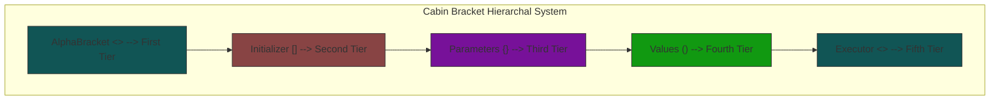
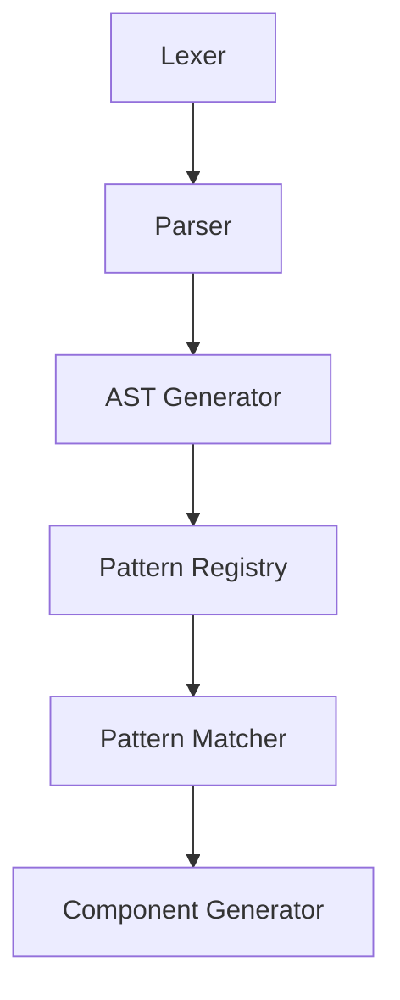

# DSL HUNT INTRODUCTION

{DIAGNOSIS-REPORT}:

1. CORE DSL STRUCTURE (CBHS):

2. KEY CHARACTERISTICS:

   - Tab-spaced and vertically aligned syntax
   - Error-tolerant continuous execution
   - Modular code block structure
   - Hierarchical bracket system (CBHS)
   - Vertical hierarchy enforcement in first two tiers

3. ARCHITECTURAL COMPONENTS:
   a) Core Integration:

   - Layered implementation
   - Bidirectional translation
   - Extensible rule system
   - Performance optimization

   b) Pattern Matching:

   - AST-based parsing
   - Pattern registry
   - Component detection
   - Property extraction
   - Relationship detection

4. IMPLEMENTATION PHASES:

   ```mermaid
   graph LR
    A[Core Parser] --> B[Pattern Matching]
    B --> C[Framework Integration]
    C --> D[Pattern Library]
    D --> E[Visualization]
    E --> F[Advanced Features]
   ```

5. TECHNICAL CONSIDERATIONS:
   a) Parser Requirements:

   - Tab-space awareness
   - Bracket hierarchy validation
   - Vertical alignment checking
   - Error recovery mechanisms

   b) Integration Points:

   - ASCII grid processing
   - Component model mapping
   - Pattern recognition system
   - Code generation pipeline

6. RECOMMENDATIONS:
   a) Implementation Priority:

   1. Core CBHS parser and validator
   2. Basic pattern matching system
   3. Component model integration
   4. Pattern library development
   5. Visualization tools
   6. Advanced features

   b) Architecture Enhancements:

   - Add pattern caching mechanism
   - Implement incremental parsing
   - Add pattern optimization system
   - Create pattern debugging tools

   c) Documentation Needs:

   - Detailed CBHS syntax guide
   - Pattern writing guidelines
   - Integration examples
   - Debugging procedures

# HUNT DSL SPECIFICATIONS

{DIAGNOSIS-REPORT}:

1. SYNTAX STRUCTURE:



2. COMMAND HIERARCHY:

   ```mermaid
   graph LR
    subgraph Commands
        H[hunt] --> T[Track]
        T --> G[GATHER/GET]
        T --> HV[HARVEST/HARV]

        G -->|Parameters| P1[tag]
        G -->|Parameters| P2[pluck]
        G -->|Parameters| P3[trap]

        HV -->|Regions| R[region_names]
    end
   ```

3. NAMING CONVENTIONS:

   - Alpha Brackets: PascalCase
   - Beta Brackets: SCREAMING_SNAKE_CASE
   - Gamma Brackets: camelCase
   - Delta Brackets: snake_case

4. KEY COMPONENTS:
   a) Commands:

   - hunt: Top-level pattern/module definition
   - Track: Pattern search and mapping
   - GATHER/GET: Data extraction
   - HARVEST/HARV: Multi-region collection

   b) Parameters:

   - tag: Component labeling
   - pluck: Content extraction
   - trap: Validation rules
   - from: Region specification

   c) Controllers:

   - Bridge (:): Links commands/parameters
   - Chain (@@): Sequences commands
   - Assignment (=): Value association

5. PATTERN TYPES:
   a) Basic Patterns:

   - Button: `[...]`
   - Checkbox: `□, ■, ☐, ☑, [ ], [X]`
   - Window: Box-drawing characters
   - Text Field: Underscores/dots

   b) Complex Patterns:

   - Forms with multiple regions
   - Validated inputs
   - Custom components
   - Inherited patterns

6. IMPLEMENTATION CONSIDERATIONS:
   a) Parser Requirements:

   - Bracket hierarchy validation
   - Naming convention enforcement
   - Pattern matching engine
   - AST generation

   b) Pattern Processing:

   - Component recognition
   - Property extraction
   - Relationship detection
   - Validation rules

   c) Code Generation:

   - Template system
   - Framework adapters
   - Custom formatting
   - Validation integration

7. RECOMMENDATIONS:
   a) Parser Implementation:

   ```python
   class DslParser:
       def __init__(self):
           self.token_types = {
               'ALPHA_OPEN': r'<',
               'ALPHA_CLOSE': r'>',
               'BETA_OPEN': r'\[',
               'BETA_CLOSE': r'\]',
               'GAMMA_OPEN': r'{',
               'GAMMA_CLOSE': r'}',
               'DELTA_OPEN': r'\(',
               'DELTA_CLOSE': r'\)',
               'COMMAND': r'hunt|Track|GATHER|HARVEST',
               'PARAM': r'param',
               'TAG': r'tag',
               'PLUCK': r'pluck',
               'TRAP': r'trap',
               'IDENTIFIER': r'[a-zA-Z_][a-zA-Z0-9_]*',
               'VALUE': r'"[^"]*"',
               'BRIDGE': r':',
               'CHAIN': r'@@',
               'ASSIGN': r'='
           }
   ```

   b) Pattern Registry:

   ```python
   class PatternRegistry:
       def __init__(self):
           self.patterns = {}
           self.inheritance_map = {}
           self.constraints = {}
           self.templates = {}
   ```

   c) Code Generator:

   ```python
   class CodeGenerator:
       def __init__(self):
           self.template_engine = None
           self.framework_adapters = {}
           self.validation_rules = {}
           self.formatting_options = {}
   ```

# HUNT DSL System Specification

## 1. Core System Dependencies

### 1.1 Base Dependencies



### 1.2 Required External Systems

- ASCII Grid Processing System
- Component Model System
- Code Generation Pipeline
- Pattern Storage System

### 1.3 Optional Integration Points

- Pattern Visualization Tools
- Debug System
- Code Template Engine
- Pattern Learning System

## 2. Syntax Core (CBHS - Cabin Brackets Hierarchical System)

### 2.1 Alpha Brackets `< >` (First Tier)

**Dependencies:**

- Lexer for bracket validation
- Command parser
- Execution context

**Provides:**

- Command scope
- Module definition
- Execution context

**Example:**

```hunt
< hunt:
    [INIT =
        {param =
            (val)
        }
    ]
><EXEC>
```

### 2.2 Beta Brackets `[ ]` (Second Tier)

**Dependencies:**

- Alpha bracket context
- Initialization system
- Pattern registry

**Provides:**

- Pattern initialization
- Component definition
- Validation rules

**Example:**

```hunt
[INIT GATHER =
    {param tag:button =
        (val "[", "]")
    }
]
```

### 2.3 Gamma Brackets `{ }` (Third Tier)

**Dependencies:**

- Beta bracket context
- Parameter system
- Pattern matcher

**Provides:**

- Parameter definitions
- Pattern specifications
- Component properties

**Example:**

```hunt
{param tag:checkbox =
    (val "□", "■", "☐", "☑")
}
```

### 2.4 Delta Brackets `( )` (Fourth Tier)

**Dependencies:**

- Gamma bracket context
- Value parser
- Pattern compiler

**Provides:**

- Value definitions
- Pattern elements
- Component attributes

## 3. Command System

### 3.1 hunt Command (Primary Controller)

**Dependencies:**

- Complete CBHS system
- Pattern registry
- Execution engine

**Provides:**

- Pattern definition
- Module creation
- System initialization

**Integrates With:**

- Pattern matcher
- Component generator
- Code generator

### 3.2 Track Command (Pattern Recognition)

**Dependencies:**

- hunt command context
- Grid analysis system
- Pattern matcher

**Provides:**

- Pattern searching
- Component mapping
- Relationship detection

**Example:**

```hunt
< hunt Track:
    [INIT GATHER =
        {param tag:button =
            (val "[", "]")
        }
        {param pluck:button_text =
            (val "\\[(.+?)\\]")
        }
    ]
><EXEC>
```

### 3.3 GATHER Command (Data Extraction)

**Dependencies:**

- Track command context
- Grid accessor
- Pattern extractor

**Provides:**

- Character extraction
- Coordinate mapping
- Content analysis

### 3.4 HARVEST Command (Multi-Region Processing)

**Dependencies:**

- GATHER command
- Region manager
- Pattern combiner

**Provides:**

- Region collection
- Multi-pattern processing
- Hierarchical analysis

## 4. Parameter System

### 4.1 tag Parameter (Component Definition)

**Dependencies:**

- Pattern registry
- Component model
- Type system

**Provides:**

- Component labeling
- Type definition
- Pattern association

### 4.2 pluck Parameter (Content Extraction)

**Dependencies:**

- Pattern matcher
- Content extractor
- Regex engine

**Provides:**

- Content extraction
- Pattern matching
- Value capture

### 4.3 trap Parameter (Validation)

**Dependencies:**

- Validation system
- Error handler
- Constraint checker

**Provides:**

- Validation rules
- Error messages
- Constraint definitions

## 5. Pattern Integration System

### 5.1 Basic Pattern Integration

**Dependencies:**

- Pattern registry
- Component model
- Grid analyzer

**Provides:**

```hunt
< hunt Track:
    [INIT GATHER =
        {param tag:button =
            (val "[", "]")
        }
    ]
><EXEC>
```

### 5.2 Complex Pattern Integration

**Dependencies:**

- Basic pattern system
- Relationship detector
- Hierarchy builder

**Provides:**

```hunt
< hunt Dialog:
    [INIT GATHER =
        {param tag:dialog =
            (val
                top_left:(┌),
                top_right:(┐),
                bottom_left:(└),
                bottom_right:(┘)
            )
        }
    ]
    [INIT HARVEST =
        {param from:patterns =
            (val "Button", "TextField")
        }
    ]
><EXEC>
```

## 6. Extension Systems

### 6.1 Pattern Inheritance System

**Dependencies:**

- Pattern registry
- Inheritance resolver
- Pattern merger

**Provides:**

```hunt
< hunt Slot:
    [INIT ASSIGN =
        {param BaseButton:{pattern} =
            (val
                tag:"button",
                pattern:"\\[(.+?)\\]"
            )
        }
    ]
><EXEC>
```

### 6.2 Custom Command System

**Dependencies:**

- Command registry
- Syntax validator
- Command executor

**Provides:**

```hunt
< hunt Slot:
    [INIT ASSIGN =
        {param ANALYZE:{command} =
            (val
                syntax:"[INIT ANALYZE = {param} ]",
                handler:"analyze_components"
            )
        }
    ]
><EXEC>
```

## 7. Integration Points

### 7.1 ASCII Grid Integration

- Grid access interface
- Coordinate system
- Character mapping

### 7.2 Component Model Integration

- Component creation
- Property mapping
- Relationship building

### 7.3 Code Generation Integration

- Template system
- Framework adapters
- Code optimization

### 7.4 Pattern Storage Integration

- Pattern persistence
- Version control
- Pattern sharing

## 8. System Validation

### 8.1 Syntax Validation

- Bracket hierarchy
- Naming conventions
- Command structure

### 8.2 Pattern Validation

- Pattern integrity
- Component completeness
- Relationship validity

### 8.3 Integration Validation

- System compatibility
- Dependency resolution
- Extension validation
