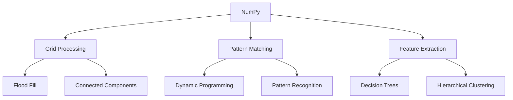
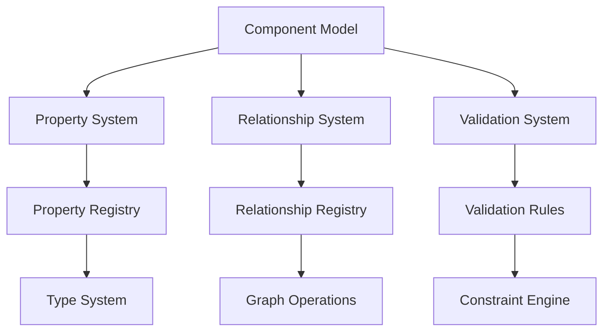
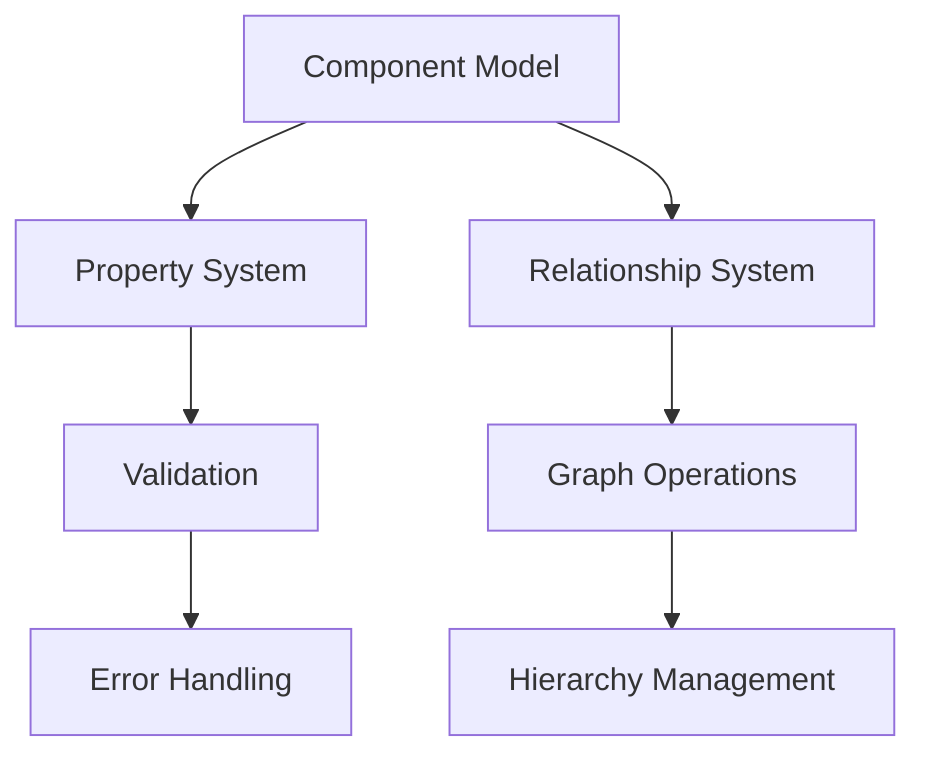
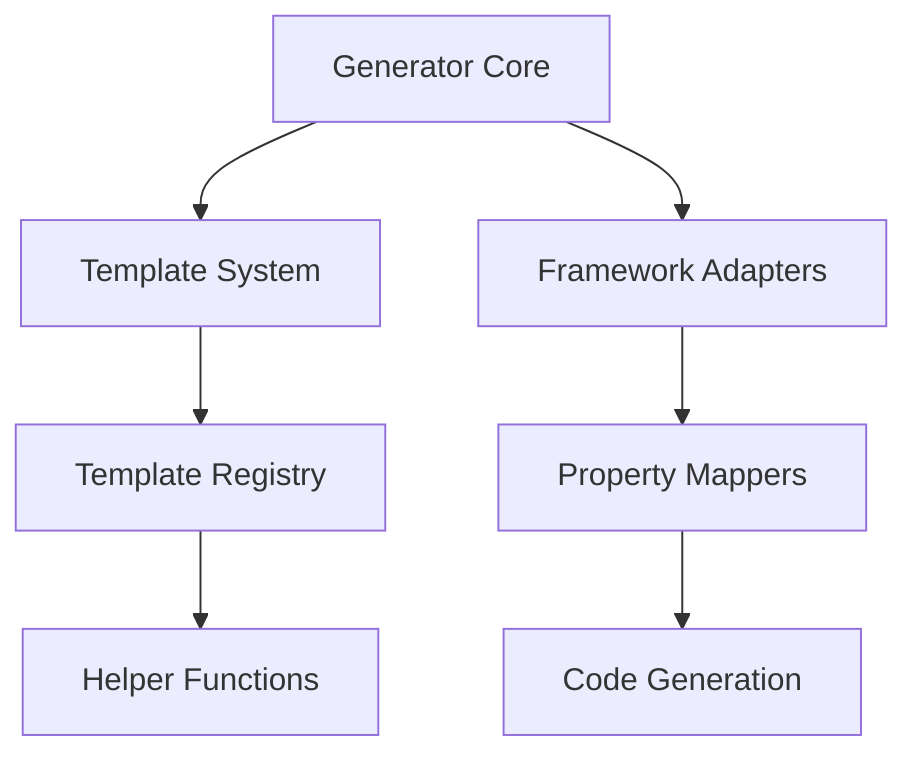
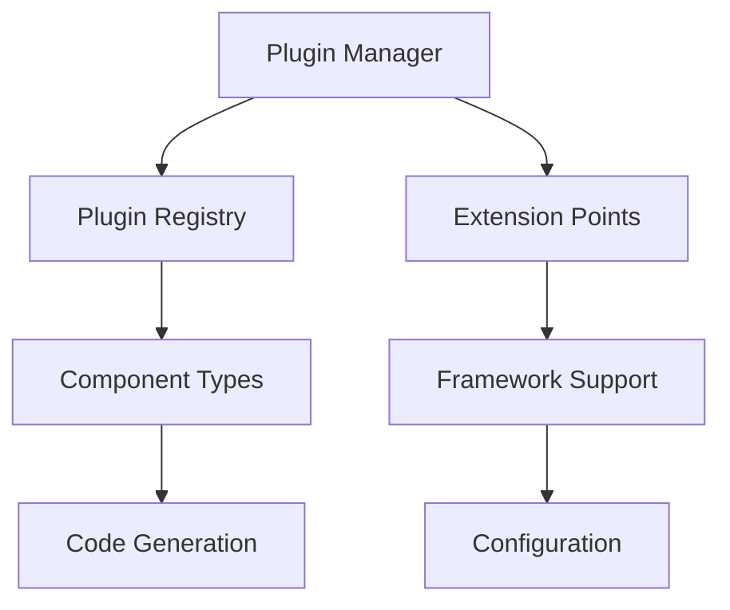

# Algorithm System Specification

## 1. Core Algorithm Dependencies

### 1.1 Base Dependencies


### 1.2 Required External Systems
- NumPy Array Processing
- OpenCV (optional for advanced image processing)
- NetworkX (for graph operations)
- SciPy (for scientific computations)

### 1.3 Optional Integration Points
- Visualization Tools
- Performance Monitoring
- Pattern Learning System
- Debug System

## 2. Mathematical Foundation

### 2.1 Core Mathematical Components
**Dependencies:**
- Linear Algebra Library
- Graph Theory Library
- Statistical Analysis Tools

**Provides:**
- DSL Interpretation Functions
- Component Transformation Functions
- Pattern Matching Operations

**Mathematical Basis:**
```math
D: \text{DSL Language}
I: D \rightarrow (C \rightarrow S) \text{ (Interpretation Function)}
f_d = I(d) \text{ where } f_d: C \rightarrow S
```

### 2.2 Composition Operations
**Dependencies:**
- Function Composition System
- Pattern Matching Engine
- Transformation Pipeline

**Provides:**
- Sequential Composition: $(d_1 ; d_2)$ → $f_{d_1} \cdot f_{d_2}$
- Conditional Application: $(d_1 \text{ if } p \text{ else } d_2)$ → $\lambda c . p(c) ? f_{d_1}(c) : f_{d_2}(c)$
- Repetition: $(d^*)$ → $\lambda c . \bigoplus_{c' \in children(c)} f_d(c')$

## 3. Flood Fill Algorithm

### 3.1 Core Implementation
**Dependencies:**
- Grid Processing System
- Queue Management
- Boundary Detection

**Provides:**
- Region Detection
- Component Boundaries
- Spatial Analysis

**Mathematical Definition:**
```math
V(x,y) = \begin{cases} 
1 & \text{if cell has been visited} \\
0 & \text{otherwise}
\end{cases}
```

### 3.2 Integration Points
- Component Recognition System
- Feature Extraction
- Pattern Matching
- Visualization System

## 4. Connected Component Analysis

### 4.1 Feature Extraction System
**Dependencies:**
- Flood Fill Results
- NumPy Operations
- Statistical Analysis

**Provides:**
- Component Features
- Spatial Relationships
- Content Analysis

**Mathematical Basis:**
```math
F_i = [f_1^i, f_2^i, ..., f_k^i]
f_{aspect}^i = \frac{width_i}{height_i}
f_{border}^i = \frac{|B_i|}{2 \times (width_i + height_i)}
```

### 4.2 Component Classification
**Dependencies:**
- Feature Vectors
- Pattern Registry
- Classification System

**Provides:**
- Component Types
- Relationship Data
- Hierarchy Information

## 5. Hierarchical Clustering

### 5.1 Clustering Engine
**Dependencies:**
- Distance Metrics
- Component Features
- Graph Operations

**Provides:**
- Component Hierarchy
- Spatial Relationships
- Logical Groupings

**Mathematical Definition:**
```math
D(C_i, C_j) = w_s \times d_s(C_i, C_j) + w_f \times d_f(C_i, C_j)
```

### 5.2 Tree Construction
**Dependencies:**
- NetworkX
- Graph Algorithms
- Tree Operations

**Provides:**
- Hierarchical Structure
- Component Relationships
- Layout Information

## 6. Decision Trees

### 6.1 Classification System
**Dependencies:**
- Feature Extraction
- Training Data
- Pattern Registry

**Provides:**
- Component Classification
- Confidence Scores
- Feature Importance

**Mathematical Basis:**
```math
H(S) = -\sum_{y \in Y} p(y) \log_2 p(y)
IG(S, f_j) = H(S) - \sum_{v \in Values(f_j)} \frac{|S_v|}{|S|} H(S_v)
```

## 7. Dynamic Programming

### 7.1 Pattern Matching
**Dependencies:**
- String Operations
- Matrix Operations
- Optimization System

**Provides:**
- Sequence Alignment
- Edit Distance
- Pattern Recognition

**Mathematical Basis:**
```math
F(i,j) = \max \begin{cases} 
F(i-1,j-1) + s(a_i, b_j) \\
F(i-1,j) + g \\
F(i,j-1) + g
\end{cases}
```

### 7.2 Optimization System
**Dependencies:**
- Cache Management
- Memory Operations
- Performance Metrics

**Provides:**
- Memoization
- Result Caching
- Performance Optimization

## 8. System Integration

### 8.1 Pipeline Integration
- Algorithm Sequencing
- Data Flow Management
- Result Aggregation

### 8.2 Performance Management
- Resource Monitoring
- Optimization Selection
- Caching Strategy

### 8.3 Error Handling
- Algorithm Fallbacks
- Error Recovery
- Result Validation

## 9. Testing Framework

### 9.1 Algorithm Testing
- Unit Tests
- Integration Tests
- Performance Tests

### 9.2 Validation System
- Result Verification
- Accuracy Metrics
- Performance Benchmarks

# Algorithm Architecture System Specification

## 1. Abstract Component Model

### 1.1 Core Dependencies



### 1.2 Required External Systems

- Type Registry System
- Graph Processing Engine
- Serialization System
- Validation Engine

### 1.3 Optional Integration Points

- Component Visualization
- Debug System
- State Management
- Event System

## 2. Component Model Implementation

### 2.1 AbstractComponent Class

**Dependencies:**

- Property Management System
- Relationship Manager
- Validation Engine

**Provides:**

- Component Identity
- Property Storage
- Relationship Management
- Hierarchy Support

**Example:**

```python
class AbstractComponent:
    def __init__(self, component_id, component_type):
        self.id = component_id
        self.type = component_type
        self.properties = {}
        self.children = []
        self.parent = None
        self.relationships = []
```

### 2.2 Property System

**Dependencies:**

- Type Registry
- Validation Rules
- Event System

**Provides:**

- Property Definition
- Value Validation
- Change Notification

**Example:**

```python
COMPONENT_PROPERTIES = {
    'Window': {
        'required': ['title', 'width', 'height'],
        'optional': ['minimizable', 'maximizable', 'closable'],
        'defaults': {
            'minimizable': True,
            'maximizable': True,
            'closable': True
        }
    }
}
```

### 2.3 Relationship System

**Dependencies:**

- Graph Operations
- Component Registry
- Event System

**Provides:**

- Relationship Types
- Hierarchy Management
- Graph Operations

## 3. Code Generation System

### 3.1 Generator Core

**Dependencies:**

- Template Engine
- Component Model
- Framework Adapters

**Provides:**

- Code Generation
- Template Management
- Framework Integration

### 3.2 Template System

**Dependencies:**

- Template Registry
- Helper Functions
- Framework Specifics

**Provides:**

- Template Definition
- Code Rendering
- Helper Integration

### 3.3 Framework Adapters

**Dependencies:**

- Framework Registry
- Property Mappers
- Code Generator

**Provides:**

- Framework Support
- Property Mapping
- Code Customization

## 4. Plugin Architecture

### 4.1 Plugin Manager

**Dependencies:**

- Plugin Registry
- Component Types
- Generators

**Provides:**

- Plugin Registration
- Component Support
- Generator Management

### 4.2 Plugin Interface

**Dependencies:**

- Core System
- Extension Points
- Configuration System

**Provides:**

- Standard Interface
- Extension Support
- Configuration Management

### 4.3 Framework Plugins

**Dependencies:**

- Plugin System
- Framework Support
- Code Generation

**Provides:**

- Framework Integration
- Component Support
- Code Generation

## 5. DSL System

### 5.1 Parser Core

**Dependencies:**

- Lexical Analyzer
- Grammar Rules
- AST Generator

**Provides:**

- DSL Parsing
- AST Generation
- Error Handling

### 5.2 Mapping System

**Dependencies:**

- Component Model
- Template Engine
- Expression Evaluator

**Provides:**

- Component Mapping
- Property Mapping
- Code Generation

### 5.3 Template Engine

**Dependencies:**

- Expression Parser
- Data Context
- Helper Functions

**Provides:**

- Template Rendering
- Expression Evaluation
- Context Management

## 6. Integration Points

### 6.1 Component Integration



### 6.2 Generator Integration



### 6.3 Plugin Integration



## 7. System Validation

### 7.1 Component Validation

- Type Checking
- Property Validation
- Relationship Integrity

### 7.2 Generator Validation

- Template Validation
- Code Generation Verification
- Framework Compatibility

### 7.3 Plugin Validation

- Plugin Interface Compliance
- Extension Point Validation
- Configuration Validation

## 8. Error Handling

### 8.1 Component Errors

- Property Validation Errors
- Relationship Errors
- Type Errors

### 8.2 Generator Errors

- Template Errors
- Code Generation Errors
- Framework Errors

### 8.3 Plugin Errors

- Loading Errors
- Configuration Errors
- Extension Errors

## 9. Performance Considerations

### 9.1 Component Performance

- Property Access Optimization
- Relationship Caching
- Hierarchy Operations

### 9.2 Generator Performance

- Template Caching
- Code Generation Optimization
- Framework Optimization

### 9.3 Plugin Performance

- Plugin Loading
- Extension Point Optimization
- Configuration Caching
