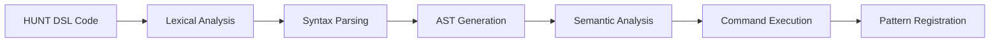

# HUNT DSL Interpreter Implementation

## 1. Integration Architecture

The HUNT DSL interpreter is integrated with the ASCII UI Translation Framework through a layered architecture that translates declarative pattern definitions into executable pattern matching rules. This document details how the DSL syntax is parsed, interpreted, and executed within the framework.

## 2. DSL Processing Pipeline

The processing of HUNT DSL code follows a multi-stage pipeline:



### 2.1 Lexical Analysis

The lexical analyzer (lexer) converts HUNT DSL code into a stream of tokens based on the CBHS bracket types and other syntax elements:

```python
def tokenize(code):
    """Tokenize HUNT DSL code into a stream of tokens."""
    tokens = []

    # Define token patterns
    patterns = [
        (r'<', 'ALPHA_OPEN'),
        (r'>', 'ALPHA_CLOSE'),
        (r'\[', 'BETA_OPEN'),
        (r'\]', 'BETA_CLOSE'),
        (r'\{', 'GAMMA_OPEN'),
        (r'\}', 'GAMMA_CLOSE'),
        (r'\(', 'DELTA_OPEN'),
        (r'\)', 'DELTA_CLOSE'),
        (r'=', 'ASSIGN'),
        (r':', 'BRIDGE'),
        (r'@@', 'CHAIN'),
        (r'&', 'LINK'),
        (r',', 'COMMA'),
        (r'hunt|Track|GATHER|GET|HARVEST|HARV|RACK|COOK', 'COMMAND'),
        (r'INIT|ASSIGN|EXEC', 'INIT_COMMAND'),
        (r'param|tag|pluck|trap|skin|log|boil', 'PARAM_COMMAND'),
        (r'val|true|false|req|prohib|floop', 'VALUE_COMMAND'),
        (r'[A-Za-z_][A-Za-z0-9_]*', 'IDENTIFIER'),
        (r'"[^"]*"', 'STRING'),
        (r'#.*$', 'COMMENT'),
        (r'\s+', 'WHITESPACE')
    ]

    # Tokenize the code
    # Implementation details...

    return tokens
```

### 2.2 Syntax Parsing

The parser analyzes the token stream and constructs an abstract syntax tree (AST) that represents the hierarchical structure of the HUNT DSL code:

```python
def parse(tokens):
    """Parse tokens into an abstract syntax tree."""
    ast = {}

    # Parse alpha bracket
    def parse_alpha_bracket():
        # Consume ALPHA_OPEN
        # Parse command or identifier
        # Check for bridge
        # Parse nested beta brackets
        # Parse closing alpha bracket and EXEC
        # Return AST node

    # Parse beta bracket
    def parse_beta_bracket():
        # Consume BETA_OPEN
        # Parse command or identifier
        # Check for assignment
        # Parse nested gamma brackets
        # Parse closing beta bracket
        # Return AST node

    # Parse gamma bracket
    def parse_gamma_bracket():
        # Consume GAMMA_OPEN
        # Parse command or identifier
        # Check for bridge or assignment
        # Parse nested delta brackets
        # Parse closing gamma bracket
        # Return AST node

    # Parse delta bracket
    def parse_delta_bracket():
        # Consume DELTA_OPEN
        # Parse values
        # Parse closing delta bracket
        # Return AST node

    # Start parsing
    ast = parse_alpha_bracket()

    return ast
```

### 2.3 AST Generation

The AST represents the hierarchical structure of the HUNT DSL code, with nodes for each bracket level and command:

```json
{
  "type": "alpha_bracket",
  "command": "hunt",
  "has_bridge": true,
  "bridge_target": "Track",
  "beta_brackets": [
    {
      "type": "beta_bracket",
      "command": "INIT",
      "has_assign": true,
      "assign_value": "GATHER",
      "gamma_brackets": [
        {
          "type": "gamma_bracket",
          "command": "param",
          "has_bridge": true,
          "bridge_target": "tag:button",
          "delta_brackets": [
            {
              "type": "delta_bracket",
              "values": ["[", "]"]
            }
          ]
        },
        {
          "type": "gamma_bracket",
          "command": "param",
          "has_bridge": true,
          "bridge_target": "pluck:button_text",
          "delta_brackets": [
            {
              "type": "delta_bracket",
              "values": ["\\[(.+?)\\]"]
            }
          ]
        }
      ]
    }
  ],
  "exec_params": [
    {
      "type": "exec_param",
      "param": null,
      "nested": null
    }
  ]
}
```

### 2.4 Semantic Analysis

The semantic analyzer validates the AST and performs type checking and context resolution:

```python
def analyze(ast, context=None):
    """Perform semantic analysis on the AST."""
    if context is None:
        context = {}

    # Validate command usage
    def validate_command(node):
        # Check if command is valid in this context
        # Validate command parameters
        # Validate nested structures

    # Validate parameter usage
    def validate_parameter(node):
        # Check if parameter is valid for the parent command
        # Validate parameter values
        # Validate parameter relationships

    # Validate value usage
    def validate_value(node):
        # Check if value is valid for the parent parameter
        # Validate value format and constraints

    # Start validation
    validate_command(ast)

    return ast, context
```

### 2.5 Command Execution

The command executor processes the AST and executes the corresponding commands:

```python
def execute(ast, context=None):
    """Execute commands based on the AST."""
    if context is None:
        context = {}

    # Execute command
    def execute_command(node):
        # Get command handler
        # Execute command with parameters
        # Process result

    # Execute parameter
    def execute_parameter(node):
        # Get parameter handler
        # Execute parameter with values
        # Process result

    # Execute value
    def execute_value(node):
        # Convert value to appropriate type
        # Apply value transformations
        # Return processed value

    # Start execution
    result = execute_command(ast)

    return result, context
```

### 2.6 Pattern Registration

The pattern registrar stores the patterns defined in the HUNT DSL code for later use:

```python
def register_pattern(pattern_data, registry=None):
    """Register a pattern in the pattern registry."""
    if registry is None:
        registry = PatternRegistry()

    # Extract pattern metadata
    pattern_id = pattern_data.get('id')
    pattern_type = pattern_data.get('type')
    pattern_rules = pattern_data.get('rules', [])

    # Create pattern object
    pattern = {
        'id': pattern_id,
        'type': pattern_type,
        'rules': pattern_rules,
        'confidence_threshold': 0.5  # Default threshold
    }

    # Register pattern
    registry.register_pattern(pattern_id, pattern)

    return pattern_id
```

## 3. Command Handler System

The command handler system maps HUNT DSL commands to their implementations:

```python
class CommandDispatcher:
    def __init__(self):
        self.command_handlers = {}

    def register_handler(self, command, handler):
        """Register a handler for a command."""
        self.command_handlers[command] = handler

    def dispatch(self, command, params, context=None):
        """Dispatch a command to its handler."""
        if context is None:
            context = {}

        if command not in self.command_handlers:
            raise ValueError(f"Unknown command: {command}")

        handler = self.command_handlers[command]
        return handler(params, context)
```

### 3.1 Core Command Handlers

The core commands are implemented as handler functions:

```python
def handle_hunt(params, context):
    """Handle the hunt command."""
    # Process hunt command parameters
    # Initialize pattern definition
    # Return pattern data

def handle_track(params, context):
    """Handle the Track command."""
    # Process Track command parameters
    # Initialize tracking pattern
    # Return tracking data

def handle_gather(params, context):
    """Handle the GATHER command."""
    # Process GATHER command parameters
    # Initialize extraction rules
    # Return extraction data

def handle_harvest(params, context):
    """Handle the HARVEST command."""
    # Process HARVEST command parameters
    # Initialize collection rules
    # Return collection data
```

### 3.2 Parameter Handlers

Parameters are processed by their respective handlers:

```python
def handle_tag(params, context):
    """Handle the tag parameter."""
    # Process tag parameter values
    # Create tag rule
    # Return tag data

def handle_pluck(params, context):
    """Handle the pluck parameter."""
    # Process pluck parameter values
    # Create extraction rule
    # Return extraction data

def handle_trap(params, context):
    """Handle the trap parameter."""
    # Process trap parameter values
    # Create constraint rule
    # Return constraint data
```

## 4. Pattern Matching Integration

The patterns defined in HUNT DSL are translated into pattern matching rules that can be applied to ASCII UI components:

```python
class PatternMatcher:
    def __init__(self, registry=None):
        self.registry = registry or PatternRegistry()

    def match_component(self, component, grid, context=None):
        """Match a component against registered patterns."""
        if context is None:
            context = {}

        # Get all patterns
        patterns = self.registry.get_all_patterns()

        # Match against each pattern
        matches = []

        for pattern_id, pattern in patterns.items():
            match_result = self._match_pattern(component, pattern, grid, context)

            if match_result['match']:
                matches.append({
                    'pattern_id': pattern_id,
                    'confidence': match_result['confidence'],
                    'properties': match_result['properties']
                })

        # Sort matches by confidence
        matches.sort(key=lambda m: m['confidence'], reverse=True)

        return matches

    def _match_pattern(self, component, pattern, grid, context):
        """Match a component against a specific pattern."""
        # Initialize match result
        result = {
            'match': False,
            'confidence': 0.0,
            'properties': {}
        }

        # Apply pattern rules
        rules = pattern.get('rules', [])

        if not rules:
            return result

        # Initialize confidence
        total_confidence = 0.0
        matched_rules = 0

        # Apply each rule
        for rule in rules:
            rule_type = rule.get('type')
            rule_handler = self._get_rule_handler(rule_type)

            if rule_handler:
                rule_result = rule_handler(component, rule, grid, context)

                if rule_result['match']:
                    total_confidence += rule_result['confidence']
                    matched_rules += 1

                    # Add properties
                    result['properties'].update(rule_result['properties'])

        # Calculate overall confidence
        if matched_rules > 0:
            result['confidence'] = total_confidence / matched_rules
            result['match'] = result['confidence'] >= pattern.get('confidence_threshold', 0.5)

        return result

    def _get_rule_handler(self, rule_type):
        """Get the handler for a specific rule type."""
        handlers = {
            'tag': self._handle_tag_rule,
            'pluck': self._handle_pluck_rule,
            'trap': self._handle_trap_rule
        }

        return handlers.get(rule_type)

    def _handle_tag_rule(self, component, rule, grid, context):
        """Handle a tag rule."""
        # Implement tag rule matching
        # Return match result

    def _handle_pluck_rule(self, component, rule, grid, context):
        """Handle a pluck rule."""
        # Implement pluck rule matching
        # Return match result

    def _handle_trap_rule(self, component, rule, grid, context):
        """Handle a trap rule."""
        # Implement trap rule validation
        # Return validation result
```

## 5. Code Generation Integration

The HUNT DSL can also define code generation templates that are used to transform recognized components into code:

```python
class CodeGenerator:
    def __init__(self, registry=None):
        self.registry = registry or TemplateRegistry()

    def generate_code(self, component_model, framework, options=None):
        """Generate code for a component model."""
        if options is None:
            options = {}

        # Get framework adapter
        adapter = self._get_framework_adapter(framework)

        if not adapter:
            raise ValueError(f"Unknown framework: {framework}")

        # Generate code
        code = adapter.generate(component_model, options)

        return code

    def _get_framework_adapter(self, framework):
        """Get the adapter for a specific framework."""
        adapters = {
            'tkinter': TkinterAdapter(self.registry),
            'pyqt': PyQtAdapter(self.registry),
            'textual': TextualAdapter(self.registry)
        }

        return adapters.get(framework)
```

### 5.1 Template Integration

Templates defined in HUNT DSL are registered in the template registry:

```python
def register_template(template_data, registry=None):
    """Register a template in the template registry."""
    if registry is None:
        registry = TemplateRegistry()

    # Extract template metadata
    template_id = template_data.get('id')
    template_framework = template_data.get('framework')
    template_component_type = template_data.get('component_type')
    template_code = template_data.get('code')

    # Create template object
    template = {
        'id': template_id,
        'framework': template_framework,
        'component_type': template_component_type,
        'code': template_code
    }

    # Register template
    registry.register_template(template_id, template)

    return template_id

class TemplateRegistry:
    def __init__(self):
        self.templates = {}
        self.framework_templates = {}
        self.component_templates = {}

    def register_template(self, template_id, template):
        """Register a template."""
        self.templates[template_id] = template

        # Register by framework
        framework = template.get('framework')
        if framework:
            if framework not in self.framework_templates:
                self.framework_templates[framework] = {}
            self.framework_templates[framework][template_id] = template

        # Register by component type
        component_type = template.get('component_type')
        if component_type:
            if component_type not in self.component_templates:
                self.component_templates[component_type] = {}
            self.component_templates[component_type][template_id] = template

    def get_template(self, template_id):
        """Get a template by ID."""
        return self.templates.get(template_id)

    def get_templates_for_framework(self, framework):
        """Get all templates for a framework."""
        return self.framework_templates.get(framework, {})

    def get_templates_for_component(self, component_type):
        """Get all templates for a component type."""
        return self.component_templates.get(component_type, {})

    def get_template_for_component_and_framework(self, component_type, framework):
        """Get a template for a specific component type and framework."""
        component_templates = self.get_templates_for_component(component_type)

        for template_id, template in component_templates.items():
            if template.get('framework') == framework:
                return template

        return None
```

### 5.2 Template Rendering

Templates are rendered using a template engine that supports expressions and control structures:

```python
class TemplateEngine:
    def __init__(self):
        self.expression_pattern = re.compile(r'\{([^}]+)\}')

    def render(self, template, data):
        """Render a template with the provided data."""
        def replace_expr(match):
            expr = match.group(1).strip()

            # Handle special case for children
            if expr == 'children':
                return '{children}'

            # Handle template expression
            try:
                result = self._evaluate_expression(expr, data)
                return str(result)
            except Exception as e:
                return f"{{Error: {str(e)}}}"

        return self.expression_pattern.sub(replace_expr, template)

    def _evaluate_expression(self, expr, data):
        """Evaluate a template expression."""
        # Component property access: component.property
        if expr.startswith('component.'):
            path = expr[10:].split('.')
            value = data.get('component')

            for key in path:
                if hasattr(value, key):
                    value = getattr(value, key)
                elif isinstance(value, dict) and key in value:
                    value = value[key]
                else:
                    return None

            return value

        # Variable access: variable_name
        elif expr in data:
            return data[expr]

        # Conditional expression: condition ? true_value : false_value
        elif ' ? ' in expr and ' : ' in expr:
            cond_expr, rest = expr.split(' ? ', 1)
            true_expr, false_expr = rest.split(' : ', 1)

            condition = self._evaluate_expression(cond_expr, data)

            if condition:
                return self._evaluate_expression(true_expr, data)
            else:
                return self._evaluate_expression(false_expr, data)

        # Function call: function_name(arg1, arg2, ...)
        elif '(' in expr and expr.endswith(')'):
            func_name, args_str = expr.split('(', 1)
            args_str = args_str[:-1]  # Remove closing parenthesis

            func_name = func_name.strip()
            args = [arg.strip() for arg in args_str.split(',') if arg.strip()]

            # Evaluate function arguments
            eval_args = [self._evaluate_expression(arg, data) for arg in args]

            # Call function
            return self._call_function(func_name, eval_args, data)

        # Literal values
        elif expr.startswith('"') and expr.endswith('"'):
            return expr[1:-1]  # Remove quotes
        elif expr.isdigit():
            return int(expr)
        elif expr.replace('.', '').isdigit() and expr.count('.') == 1:
            return float(expr)
        elif expr == 'true':
            return True
        elif expr == 'false':
            return False
        elif expr == 'null' or expr == 'none':
            return None

        # Unknown expression
        return f"{{{expr}}}"

    def _call_function(self, func_name, args, data):
        """Call a template function."""
        functions = {
            'concat': lambda *args: ''.join(str(arg) for arg in args),
            'format': lambda fmt, *args: fmt.format(*args),
            'uppercase': lambda s: str(s).upper(),
            'lowercase': lambda s: str(s).lower(),
            'capitalize': lambda s: str(s).capitalize(),
            'add': lambda a, b: a + b,
            'subtract': lambda a, b: a - b,
            'multiply': lambda a, b: a * b,
            'divide': lambda a, b: a / b if b != 0 else 0,
            'max': max,
            'min': min,
            'length': len,
            'if': lambda cond, true_val, false_val: true_val if cond else false_val
        }

        if func_name in functions:
            return functions[func_name](*args)

        # Check for custom functions in data
        if 'functions' in data and func_name in data['functions']:
            return data['functions'][func_name](*args)

        raise ValueError(f"Unknown function: {func_name}")
```

### 5.3 Framework Adapters

Framework adapters generate code for specific UI frameworks:

```python
class FrameworkAdapter:
    def __init__(self, template_registry=None):
        self.template_registry = template_registry or TemplateRegistry()
        self.template_engine = TemplateEngine()

    def generate(self, component_model, options=None):
        """Generate code for a component model."""
        if options is None:
            options = {}

        # Get framework-specific templates
        framework = self.get_framework_name()
        templates = self.template_registry.get_templates_for_framework(framework)

        if not templates:
            raise ValueError(f"No templates found for framework: {framework}")

        # Generate code for each root component
        code_parts = []

        for root_id in component_model.root_components:
            root_component = component_model.get_component(root_id)
            component_code = self._generate_component_code(root_component, component_model, options)
            code_parts.append(component_code)

        # Combine code parts
        code = self._combine_code_parts(code_parts, options)

        return code

    def get_framework_name(self):
        """Get the name of the framework."""
        raise NotImplementedError("Subclasses must implement this method")

    def _generate_component_code(self, component, component_model, options):
        """Generate code for a component."""
        # Get template for component type
        component_type = component.type
        template = self.template_registry.get_template_for_component_and_framework(component_type, self.get_framework_name())

        if not template:
            # Try default template
            template = self.template_registry.get_template_for_component_and_framework('default', self.get_framework_name())

        if not template:
            raise ValueError(f"No template found for component type: {component_type}")

        # Prepare template data
        data = {
            'component': component,
            'model': component_model,
            'options': options
        }

        # Generate code for children
        children_code = []

        for child_id in component_model.get_contained_components(component.id):
            child_component = component_model.get_component(child_id)
            child_code = self._generate_component_code(child_component, component_model, options)
            children_code.append(child_code)

        # Add children code to data
        data['children_code'] = children_code

        # Render template
        template_code = template.get('code', '')
        code = self.template_engine.render(template_code, data)

        # Replace children placeholder
        if '{children}' in code and children_code:
            children_str = '\n'.join(children_code)
            code = code.replace('{children}', children_str)

        return code

    def _combine_code_parts(self, code_parts, options):
        """Combine code parts into a complete program."""
        # Implement framework-specific code combination
        raise NotImplementedError("Subclasses must implement this method")

class TkinterAdapter(FrameworkAdapter):
    def get_framework_name(self):
        return "tkinter"

    def _combine_code_parts(self, code_parts, options):
        # Add imports
        imports = [
            "import tkinter as tk",
            "from tkinter import ttk"
        ]

        # Create main function
        main_code = [
            "def main():",
            "    root = tk.Tk()",
            "    root.title('ASCII UI Application')",
            "    root.geometry('800x600')"
        ]

        # Add component code
        for part in code_parts:
            # Indent component code
            indented_part = '\n'.join(f"    {line}" for line in part.splitlines())
            main_code.append(indented_part)

        # Add mainloop call
        main_code.append("    root.mainloop()")

        # Add script entry point
        script_entry = [
            "",
            "if __name__ == '__main__':",
            "    main()"
        ]

        # Combine all code parts
        code = '\n'.join(imports + [''] + main_code + script_entry)

        return code

class PyQtAdapter(FrameworkAdapter):
    def get_framework_name(self):
        return "pyqt"

    def _combine_code_parts(self, code_parts, options):
        # Implementation for PyQt
        # Similar to TkinterAdapter but with PyQt-specific code
        pass

class TextualAdapter(FrameworkAdapter):
    def get_framework_name(self):
        return "textual"

    def _combine_code_parts(self, code_parts, options):
        # Implementation for Textual
        # Similar to TkinterAdapter but with Textual-specific code
        pass
```

## 6. End-to-End Integration Example

The following example demonstrates how the HUNT DSL interpreter integrates with the ASCII UI Translation Framework for a complete processing workflow:

```python
def process_ascii_ui_with_hunt(ascii_text, hunt_patterns=None, options=None):
    """Process ASCII UI with HUNT patterns."""
    if options is None:
        options = {}

    # Initialize framework components
    pattern_registry = PatternRegistry()
    hunt_interpreter = HuntInterpreter(pattern_registry)

    # Process HUNT patterns
    if hunt_patterns:
        for pattern in hunt_patterns:
            hunt_interpreter.interpret(pattern)

    # Create grid from ASCII text
    grid = ASCIIGrid(ascii_text)

    # Initialize processing pipeline
    pipeline = ProcessingPipeline()

    # Register processors
    flood_fill_processor = FloodFillProcessor()
    contour_detector = ContourDetectionProcessor()
    pattern_matcher = PatternMatcher(pattern_registry)
    relationship_analyzer = RelationshipAnalysisProcessor()
    code_generator = CodeGenerator()

    pipeline.register_processor(flood_fill_processor, 'flood_fill')
    pipeline.register_processor(contour_detector, 'contour_detection')
    pipeline.register_processor(pattern_matcher, 'pattern_matching')
    pipeline.register_processor(relationship_analyzer, 'relationship_analysis')
    pipeline.register_processor(code_generator, 'code_generation')

    # Create context
    context = {
        'options': options,
        'grid': grid,
        'pattern_registry': pattern_registry
    }

    # Process the ASCII UI
    result, _ = pipeline.process(grid, context)

    # Return the result
    return result
```

This function demonstrates how the HUNT DSL interpreter is integrated into the overall framework to process ASCII UI designs with custom pattern definitions.

## 7. HUNT DSL Integration with Pattern Recognition

The HUNT DSL provides a powerful way to define patterns for recognizing UI components in ASCII art. The `Track` command with `tag` and `pluck` parameters defines what to look for and what to extract:

```hunt
< hunt Track:
    [INIT GATHER =
        {param tag:button =
            (val "[", "]")
        }
        {param pluck:button_text =
            (val "\\[(.+?)\\]")
        }
    ]
><EXEC>
```

This HUNT DSL code is processed by the interpreter and translated into pattern matching rules:

```json
{
  "id": "button",
  "type": "component",
  "rules": [
    {
      "type": "tag",
      "tag_name": "button",
      "values": ["[", "]"]
    },
    {
      "type": "pluck",
      "target": "button_text",
      "pattern": "\\[(.+?)\\]"
    }
  ],
  "confidence_threshold": 0.5
}
```

When applied to an ASCII UI component, the pattern matcher:

1. Checks if the component contains the characters "[" and "]"
2. Extracts text matching the pattern "\[(.+?)\]" as the button_text property
3. Calculates a confidence score based on how well the component matches the pattern
4. If the confidence score exceeds the threshold, classifies the component as a button

This integration between the HUNT DSL and pattern recognition allows users to define complex patterns in a declarative syntax while leveraging the full power of the recognition algorithms.

## 8. HUNT DSL Integration with Code Generation

The HUNT DSL also integrates with the code generation system through the `COOK` command and template definitions:

```hunt
< hunt ButtonTemplate:
    [INIT COOK =
        {param format:tkinter =
            (val
             template:"""
             # Button: {component.properties.button_text}
             button_{component.id} = tk.Button(root, text="{component.properties.button_text}")
             button_{component.id}.place(x={component.properties.x}, y={component.properties.y})
             """
            )
        }
    ]
><EXEC>
```

This HUNT DSL code registers a template for generating Tkinter code for button components. The template includes expressions that access component properties and can include logic for formatting the code.
The integration between the HUNT DSL and code generation allows users to define custom templates for different component types and frameworks, providing flexibility in how recognized components are translated into code.

## 9. Conclusion

The HUNT DSL interpreter is tightly integrated with the ASCII UI Translation Framework, providing a powerful and flexible way to define patterns for recognizing UI components and generating code. The DSL's hierarchical structure maps naturally to the component hierarchy of UI designs, making it an ideal language for this domain.
The interpreter translates the declarative pattern definitions of the HUNT DSL into executable rules that can be applied to ASCII UI components, bridging the gap between human-readable pattern definitions and machine-executable recognition algorithms.
Through its integration with the pattern recognition and code generation systems, the HUNT DSL enables users to customize and extend the framework's capabilities without modifying the core code, providing a powerful tool for ASCII UI translation.
