# HUNT ASCII UI Translation System Architecture

## 1. Executive Summary

The HUNT ASCII UI Translation System is a comprehensive framework designed to convert ASCII User Interface designs into functional Python code. The system leverages a purpose-built Domain Specific Language (DSL) called HUNT with its Cabin Brackets Hierarchical System (CBHS) to precisely define pattern recognition rules and code generation templates. This document outlines the complete system architecture, including core components, data flow, subsystems, integration points, and design patterns.

## 2. System Overview

### 2.1 Core Functionality

The HUNT ASCII UI Translation System provides the following core capabilities:

1. **ASCII UI Recognition**: Analyzes ASCII text input to detect and classify UI components through pattern matching and spatial analysis algorithms.
2. **Component Modeling**: Creates a structured representation of UI elements including their properties, relationships, and hierarchy.
3. **Code Generation**: Transforms recognized UI components into executable Python code targeting various UI frameworks (e.g., Tkinter, PyQt).
4. **Pattern Definition**: Enables users to define custom patterns and rules for UI component recognition using the HUNT DSL.
5. **Customization and Extension**: Provides a plugin architecture for extending the system's capabilities with new patterns, code generators, and algorithms.


### 2.2 High-Level Architecture

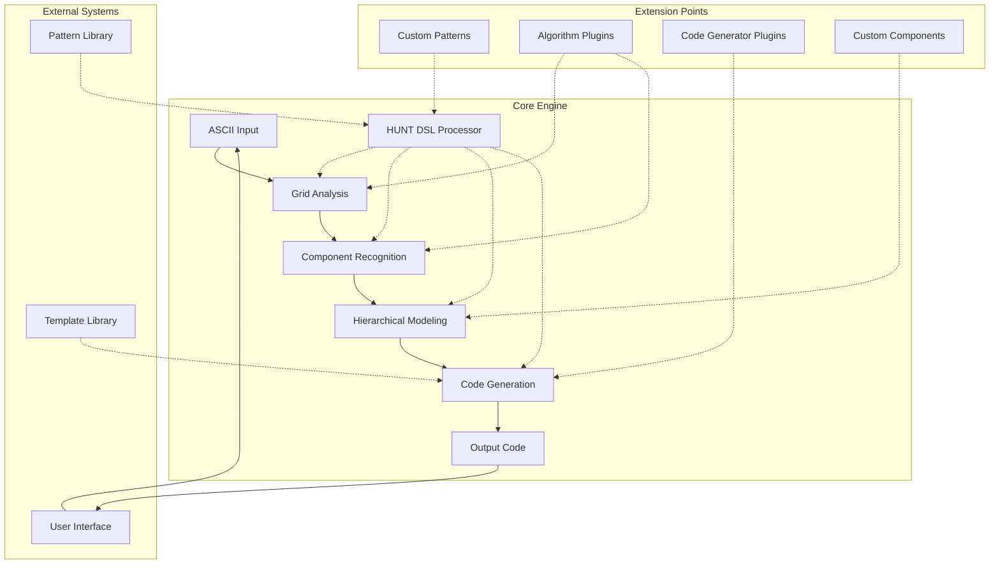
```mermaid
graph TD
    subgraph "Core Engine"
        A[ASCII Input] --> B[Grid Analysis]
        B --> C[Component Recognition]
        C --> D[Hierarchical Modeling]
        D --> E[Code Generation]
        E --> F[Output Code]

        H[HUNT DSL Processor] -.-> B
        H -.-> C
        H -.-> D
        H -.-> E
    end

    subgraph "External Systems"
        I[Pattern Library] -.-> H
        J[Template Library] -.-> E
        K[User Interface] --> A
        F --> K
    end

    subgraph "Extension Points"
        L[Custom Patterns]
        M[Algorithm Plugins]
        N[Code Generator Plugins]
        O[Custom Components]

        L -.-> H
        M -.-> B
        M -.-> C
        N -.-> E
        O -.-> D
    end
```

### 2.3 System Context

The HUNT ASCII UI Translation System interacts with the following external systems:

1. **User Interface**: The front-end application that provides tools for ASCII UI design, pattern definition, and code generation.
2. **File System**: Stores and retrieves ASCII UI designs, HUNT patterns, and generated code.
3. **Target UI Frameworks**: The frameworks for which code is generated (Tkinter, PyQt, Textual, etc.).

## 3. Architectural Components

### 3.1 Data Flow Architecture

The system follows a sequential pipeline architecture with distinct processing stages, each transforming the data for the next stage:

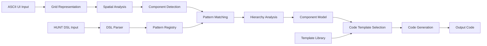
```mermaid
flowchart LR
    A["ASCII UI Input"] --> B["Grid Representation"]
    B --> C["Spatial Analysis"]
    C --> D["Component Detection"]
    D --> E["Pattern Matching"]
    E --> F["Hierarchy Analysis"]
    F --> G["Component Model"]
    G --> H["Code Template Selection"]
    H --> I["Code Generation"]
    I --> J["Output Code"]

    K["HUNT DSL Input"] --> L["DSL Parser"]
    L --> M["Pattern Registry"]
    M --> E

    N["Template Library"] --> H
```

### 3.2 Core Subsystems

#### 3.2.1 HUNT DSL Subsystem

The HUNT DSL Subsystem is responsible for parsing, interpreting, and executing HUNT DSL code to define pattern recognition rules and code generation templates.

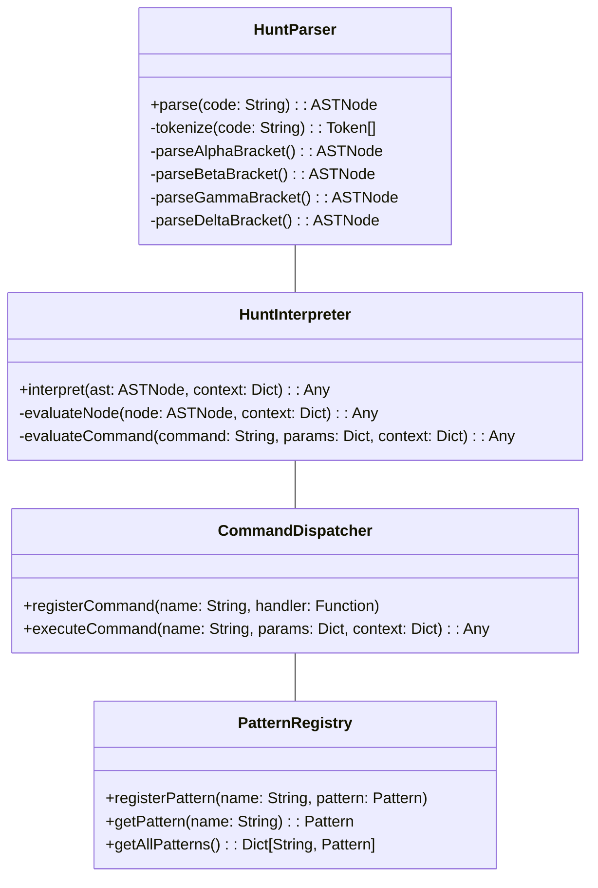
```mermaid
classDiagram
    class HuntParser {
        +parse(code: String): ASTNode
        -tokenize(code: String): Token[]
        -parseAlphaBracket(): ASTNode
        -parseBetaBracket(): ASTNode
        -parseGammaBracket(): ASTNode
        -parseDeltaBracket(): ASTNode
    }

    class HuntInterpreter {
        +interpret(ast: ASTNode, context: Dict): Any
        -evaluateNode(node: ASTNode, context: Dict): Any
        -evaluateCommand(command: String, params: Dict, context: Dict): Any
    }

    class CommandDispatcher {
        +registerCommand(name: String, handler: Function)
        +executeCommand(name: String, params: Dict, context: Dict): Any
    }

    class PatternRegistry {
        +registerPattern(name: String, pattern: Pattern)
        +getPattern(name: String): Pattern
        +getAllPatterns(): Dict[String, Pattern]
    }

    HuntParser -- HuntInterpreter
    HuntInterpreter -- CommandDispatcher
    CommandDispatcher -- PatternRegistry
```

#### 3.2.2 Grid Analysis Subsystem

The Grid Analysis Subsystem processes the ASCII input to identify spatial structures, boundaries, and regions.

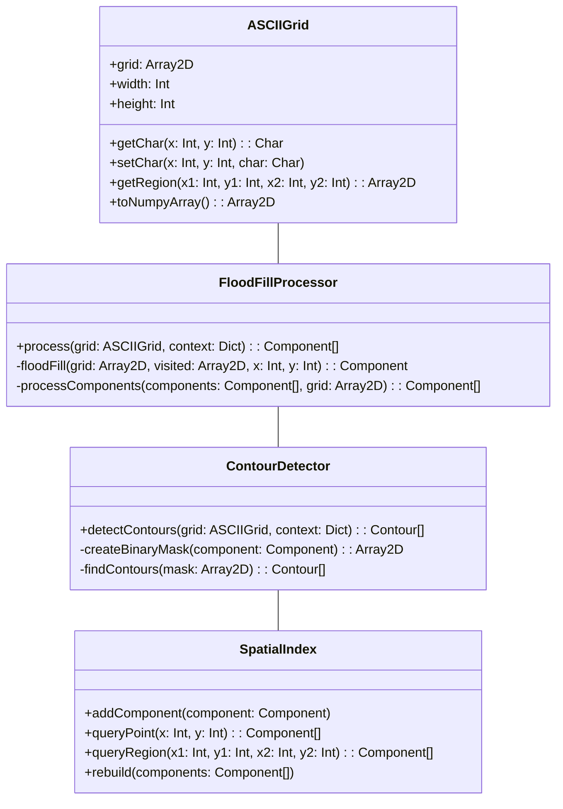
```mermaid
classDiagram
    class ASCIIGrid {
        +grid: Array2D
        +width: Int
        +height: Int
        +getChar(x: Int, y: Int): Char
        +setChar(x: Int, y: Int, char: Char)
        +getRegion(x1: Int, y1: Int, x2: Int, y2: Int): Array2D
        +toNumpyArray(): Array2D
    }

    class FloodFillProcessor {
        +process(grid: ASCIIGrid, context: Dict): Component[]
        -floodFill(grid: Array2D, visited: Array2D, x: Int, y: Int): Component
        -processComponents(components: Component[], grid: Array2D): Component[]
    }

    class ContourDetector {
        +detectContours(grid: ASCIIGrid, context: Dict): Contour[]
        -createBinaryMask(component: Component): Array2D
        -findContours(mask: Array2D): Contour[]
    }

    class SpatialIndex {
        +addComponent(component: Component)
        +queryPoint(x: Int, y: Int): Component[]
        +queryRegion(x1: Int, y1: Int, x2: Int, y2: Int): Component[]
        +rebuild(components: Component[])
    }

    ASCIIGrid -- FloodFillProcessor
    FloodFillProcessor -- ContourDetector
    ContourDetector -- SpatialIndex
```

#### 3.2.3 Component Recognition Subsystem

The Component Recognition Subsystem identifies UI components from the spatial analysis results.

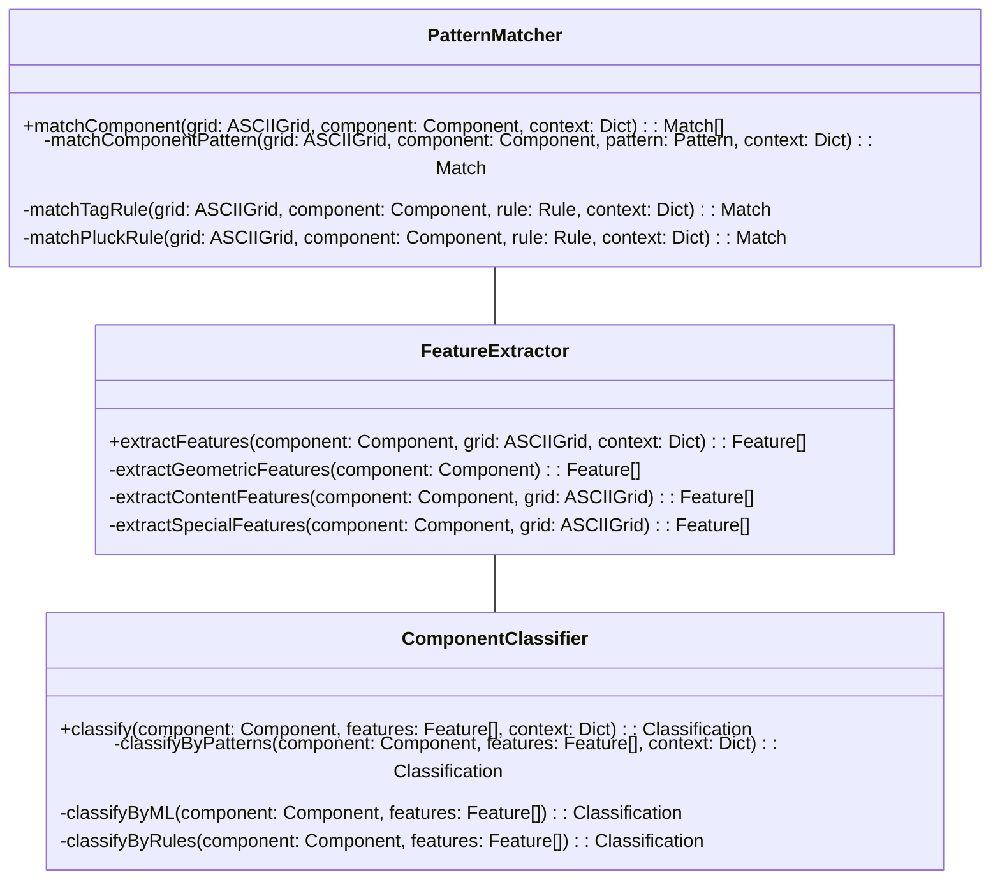
```mermaid
classDiagram
    class PatternMatcher {
        +matchComponent(grid: ASCIIGrid, component: Component, context: Dict): Match[]
        -matchComponentPattern(grid: ASCIIGrid, component: Component, pattern: Pattern, context: Dict): Match
        -matchTagRule(grid: ASCIIGrid, component: Component, rule: Rule, context: Dict): Match
        -matchPluckRule(grid: ASCIIGrid, component: Component, rule: Rule, context: Dict): Match
    }

    class FeatureExtractor {
        +extractFeatures(component: Component, grid: ASCIIGrid, context: Dict): Feature[]
        -extractGeometricFeatures(component: Component): Feature[]
        -extractContentFeatures(component: Component, grid: ASCIIGrid): Feature[]
        -extractSpecialFeatures(component: Component, grid: ASCIIGrid): Feature[]
    }

    class ComponentClassifier {
        +classify(component: Component, features: Feature[], context: Dict): Classification
        -classifyByPatterns(component: Component, features: Feature[], context: Dict): Classification
        -classifyByML(component: Component, features: Feature[]): Classification
        -classifyByRules(component: Component, features: Feature[]): Classification
    }

    PatternMatcher -- FeatureExtractor
    FeatureExtractor -- ComponentClassifier
```

#### 3.2.4 Hierarchical Modeling Subsystem

The Hierarchical Modeling Subsystem establishes parent-child relationships and builds the component hierarchy.

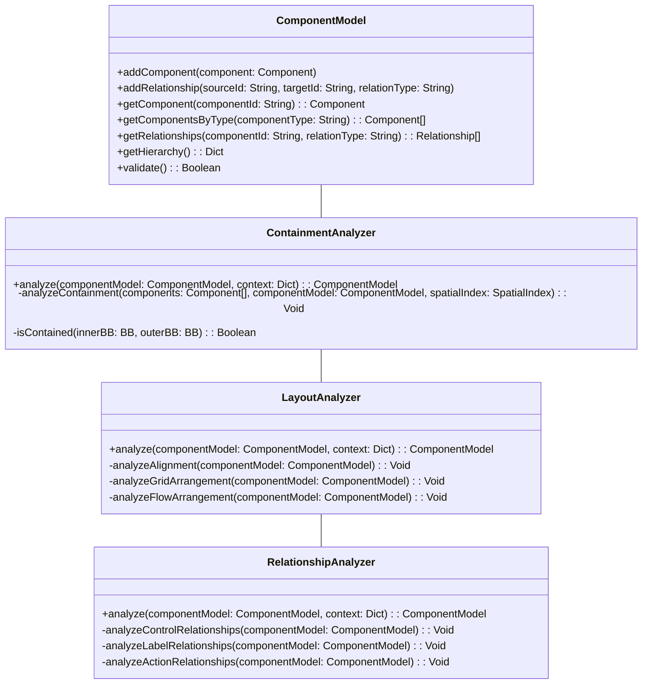
```mermaid
classDiagram
    class ComponentModel {
        +addComponent(component: Component)
        +addRelationship(sourceId: String, targetId: String, relationType: String)
        +getComponent(componentId: String): Component
        +getComponentsByType(componentType: String): Component[]
        +getRelationships(componentId: String, relationType: String): Relationship[]
        +getHierarchy(): Dict
        +validate(): Boolean
    }

    class ContainmentAnalyzer {
        +analyze(componentModel: ComponentModel, context: Dict): ComponentModel
        -analyzeContainment(components: Component[], componentModel: ComponentModel, spatialIndex: SpatialIndex): Void
        -isContained(innerBB: BB, outerBB: BB): Boolean
    }

    class LayoutAnalyzer {
        +analyze(componentModel: ComponentModel, context: Dict): ComponentModel
        -analyzeAlignment(componentModel: ComponentModel): Void
        -analyzeGridArrangement(componentModel: ComponentModel): Void
        -analyzeFlowArrangement(componentModel: ComponentModel): Void
    }

    class RelationshipAnalyzer {
        +analyze(componentModel: ComponentModel, context: Dict): ComponentModel
        -analyzeControlRelationships(componentModel: ComponentModel): Void
        -analyzeLabelRelationships(componentModel: ComponentModel): Void
        -analyzeActionRelationships(componentModel: ComponentModel): Void
    }

    ComponentModel -- ContainmentAnalyzer
    ContainmentAnalyzer -- LayoutAnalyzer
    LayoutAnalyzer -- RelationshipAnalyzer
```

#### 3.2.5 Code Generation Subsystem

The Code Generation Subsystem transforms the component model into framework-specific code.

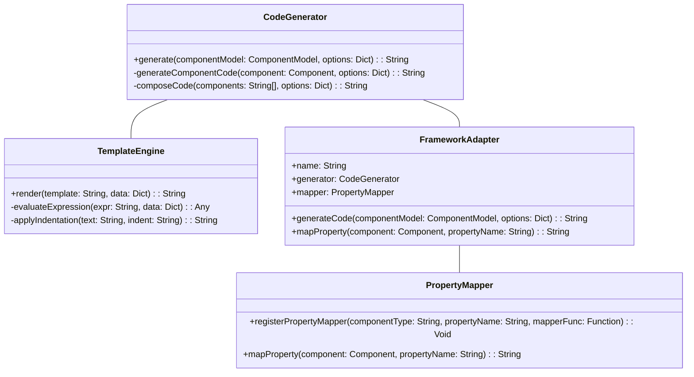
```mermaid
classDiagram
    class CodeGenerator {
        +generate(componentModel: ComponentModel, options: Dict): String
        -generateComponentCode(component: Component, options: Dict): String
        -composeCode(components: String[], options: Dict): String
    }

    class TemplateEngine {
        +render(template: String, data: Dict): String
        -evaluateExpression(expr: String, data: Dict): Any
        -applyIndentation(text: String, indent: String): String
    }

    class FrameworkAdapter {
        +name: String
        +generator: CodeGenerator
        +mapper: PropertyMapper
        +generateCode(componentModel: ComponentModel, options: Dict): String
        +mapProperty(component: Component, propertyName: String): String
    }

    class PropertyMapper {
        +registerPropertyMapper(componentType: String, propertyName: String, mapperFunc: Function): Void
        +mapProperty(component: Component, propertyName: String): String
    }

    CodeGenerator -- TemplateEngine
    CodeGenerator -- FrameworkAdapter
    FrameworkAdapter -- PropertyMapper
```

### 3.3 Integration Points

#### 3.3.1 HUNT DSL and Backend Integration

The HUNT DSL integrates with the backend processing pipeline through a well-defined interface:

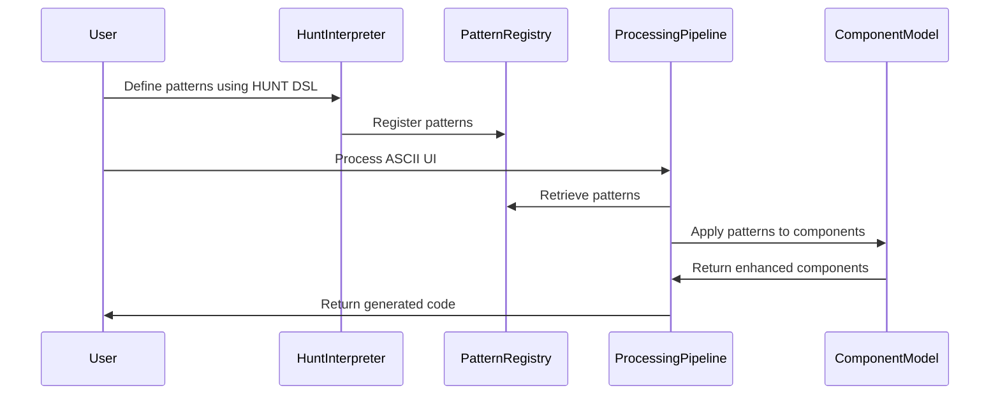
```mermaid
sequenceDiagram
    participant User
    participant HuntInterpreter
    participant PatternRegistry
    participant ProcessingPipeline
    participant ComponentModel

    User->>HuntInterpreter: Define patterns using HUNT DSL
    HuntInterpreter->>PatternRegistry: Register patterns

    User->>ProcessingPipeline: Process ASCII UI
    ProcessingPipeline->>PatternRegistry: Retrieve patterns
    ProcessingPipeline->>ComponentModel: Apply patterns to components
    ComponentModel->>ProcessingPipeline: Return enhanced components
    ProcessingPipeline->>User: Return generated code
```

#### 3.3.2 Plugin System

The system provides a robust plugin architecture for extensibility:

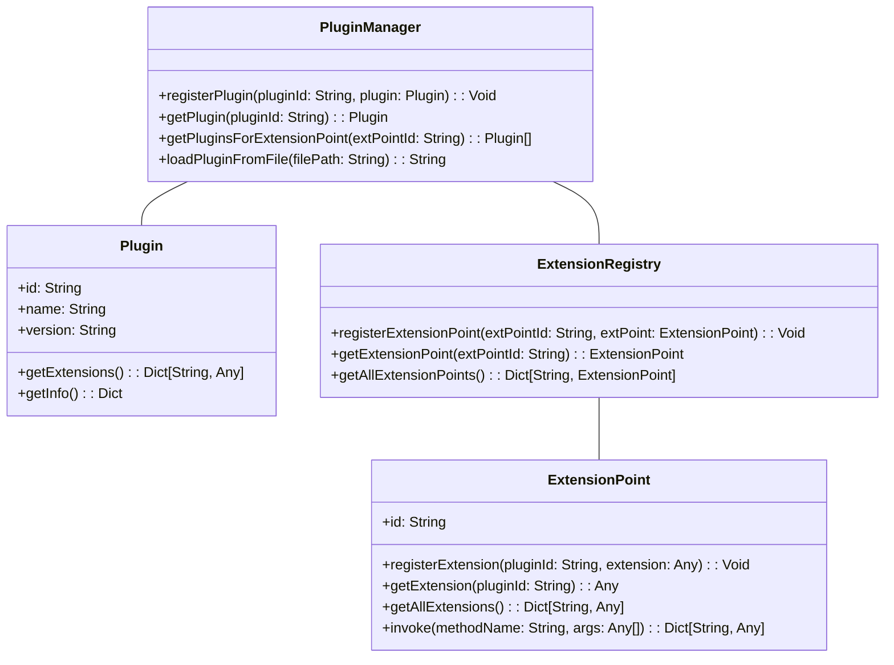
```mermaid
classDiagram
    class PluginManager {
        +registerPlugin(pluginId: String, plugin: Plugin): Void
        +getPlugin(pluginId: String): Plugin
        +getPluginsForExtensionPoint(extPointId: String): Plugin[]
        +loadPluginFromFile(filePath: String): String
    }

    class Plugin {
        +id: String
        +name: String
        +version: String
        +getExtensions(): Dict[String, Any]
        +getInfo(): Dict
    }

    class ExtensionPoint {
        +id: String
        +registerExtension(pluginId: String, extension: Any): Void
        +getExtension(pluginId: String): Any
        +getAllExtensions(): Dict[String, Any]
        +invoke(methodName: String, args: Any[]): Dict[String, Any]
    }

    class ExtensionRegistry {
        +registerExtensionPoint(extPointId: String, extPoint: ExtensionPoint): Void
        +getExtensionPoint(extPointId: String): ExtensionPoint
        +getAllExtensionPoints(): Dict[String, ExtensionPoint]
    }

    PluginManager -- Plugin
    PluginManager -- ExtensionRegistry
    ExtensionRegistry -- ExtensionPoint
```

## 4. HUNT DSL Architecture

### 4.1 DSL Syntax Structure

The HUNT DSL follows a hierarchical structure defined by the Cabin Brackets Hierarchical System (CBHS), which consists of four levels of nested brackets:

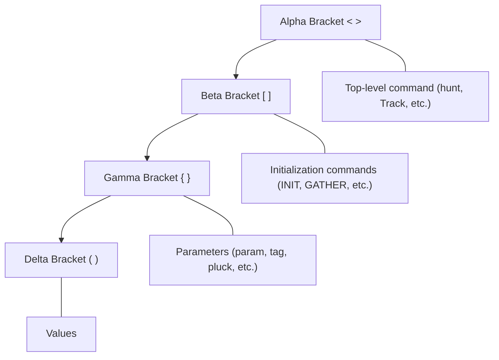
```mermaid
flowchart TD
    A["Alpha Bracket < >"]
    B["Beta Bracket [ ]"]
    C["Gamma Bracket { }"]
    D["Delta Bracket ( )"]

    A --> B
    B --> C
    C --> D

    A --- A1["Top-level command (hunt, Track, etc.)"]
    B --- B1["Initialization commands (INIT, GATHER, etc.)"]
    C --- C1["Parameters (param, tag, pluck, etc.)"]
    D --- D1["Values"]
```

### 4.2 DSL Processing Pipeline

The processing of HUNT DSL code follows a multi-stage pipeline:

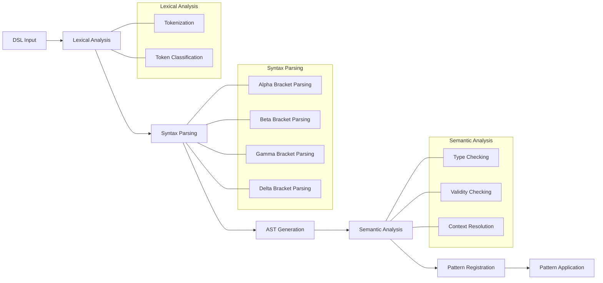
```mermaid
flowchart LR
    A["DSL Input"] --> B["Lexical Analysis"]
    B --> C["Syntax Parsing"]
    C --> D["AST Generation"]
    D --> E["Semantic Analysis"]
    E --> F["Pattern Registration"]
    F --> G["Pattern Application"]

    subgraph "Lexical Analysis"
        B1["Tokenization"]
        B2["Token Classification"]
    end

    subgraph "Syntax Parsing"
        C1["Alpha Bracket Parsing"]
        C2["Beta Bracket Parsing"]
        C3["Gamma Bracket Parsing"]
        C4["Delta Bracket Parsing"]
    end

    subgraph "Semantic Analysis"
        E1["Type Checking"]
        E2["Validity Checking"]
        E3["Context Resolution"]
    end

    B --- B1
    B --- B2
    C --- C1
    C --- C2
    C --- C3
    C --- C4
    E --- E1
    E --- E2
    E --- E3
```

### 4.3 DSL Command Mapping

The HUNT DSL commands map to specific backend functions through a dispatcher system:

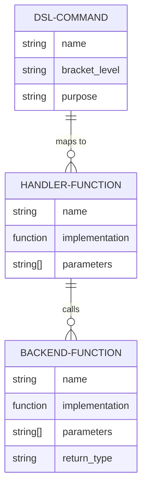
```mermaid
erDiagram
    DSL-COMMAND ||--o{ HANDLER-FUNCTION : "maps to"
    HANDLER-FUNCTION ||--o{ BACKEND-FUNCTION : "calls"

    DSL-COMMAND {
        string name
        string bracket_level
        string purpose
    }

    HANDLER-FUNCTION {
        string name
        function implementation
        string[] parameters
    }

    BACKEND-FUNCTION {
        string name
        function implementation
        string[] parameters
        string return_type
    }
```

## 5. Data Model

### 5.1 ASCII Grid Representation

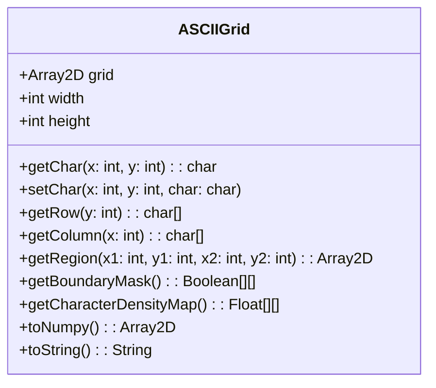
```mermaid
classDiagram
    class ASCIIGrid {
        +Array2D grid
        +int width
        +int height
        +getChar(x: int, y: int): char
        +setChar(x: int, y: int, char: char)
        +getRow(y: int): char[]
        +getColumn(x: int): char[]
        +getRegion(x1: int, y1: int, x2: int, y2: int): Array2D
        +getBoundaryMask(): Boolean[][]
        +getCharacterDensityMap(): Float[][]
        +toNumpy(): Array2D
        +toString(): String
    }
```

### 5.2 Component Model

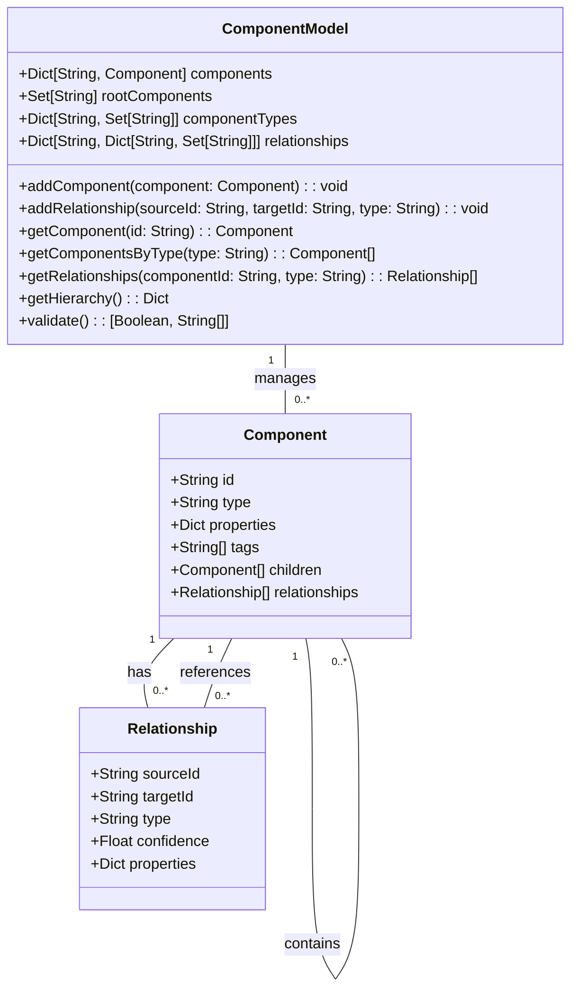
```mermaid
classDiagram
    class Component {
        +String id
        +String type
        +Dict properties
        +String[] tags
        +Component[] children
        +Relationship[] relationships
    }

    class Relationship {
        +String sourceId
        +String targetId
        +String type
        +Float confidence
        +Dict properties
    }

    class ComponentModel {
        +Dict[String, Component] components
        +Set[String] rootComponents
        +Dict[String, Set[String]] componentTypes
        +Dict[String, Dict[String, Set[String]]] relationships

        +addComponent(component: Component): void
        +addRelationship(sourceId: String, targetId: String, type: String): void
        +getComponent(id: String): Component
        +getComponentsByType(type: String): Component[]
        +getRelationships(componentId: String, type: String): Relationship[]
        +getHierarchy(): Dict
        +validate(): [Boolean, String[]]
    }

    Component "1" -- "0..*" Component : contains
    Component "1" -- "0..*" Relationship : has
    Relationship "0..*" -- "1" Component : references
    ComponentModel "1" -- "0..*" Component : manages
```

### 5.3 Pattern Representation

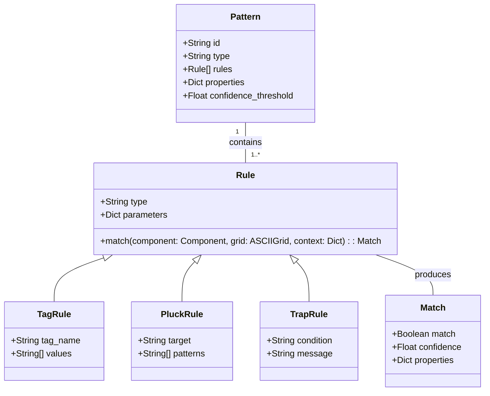
```mermaid
classDiagram
    class Pattern {
        +String id
        +String type
        +Rule[] rules
        +Dict properties
        +Float confidence_threshold
    }

    class Rule {
        +String type
        +Dict parameters
        +match(component: Component, grid: ASCIIGrid, context: Dict): Match
    }

    class TagRule {
        +String tag_name
        +String[] values
    }

    class PluckRule {
        +String target
        +String[] patterns
    }

    class TrapRule {
        +String condition
        +String message
    }

    class Match {
        +Boolean match
        +Float confidence
        +Dict properties
    }

    Pattern "1" -- "1..*" Rule : contains
    Rule <|-- TagRule
    Rule <|-- PluckRule
    Rule <|-- TrapRule
    Rule -- Match : produces
```

## 6. Communication Patterns

### 6.1 Inter-Component Communication

The system uses a combination of direct method calls, event publishing, and shared context for communication between components:

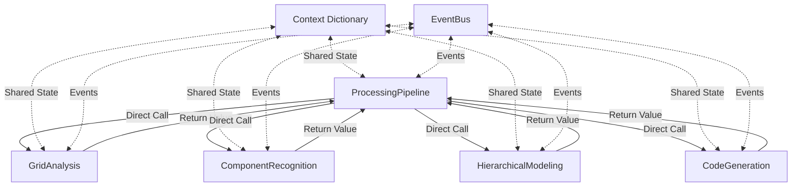
```mermaid
flowchart TD
    A[ProcessingPipeline] -->|Direct Call| B[GridAnalysis]
    B -->|Return Value| A
    A -->|Direct Call| C[ComponentRecognition]
    C -->|Return Value| A
    A -->|Direct Call| D[HierarchicalModeling]
    D -->|Return Value| A
    A -->|Direct Call| E[CodeGeneration]
    E -->|Return Value| A

    F[Context Dictionary] <-.->|Shared State| A
    F <-.->|Shared State| B
    F <-.->|Shared State| C
    F <-.->|Shared State| D
    F <-.->|Shared State| E

    G[EventBus] <-.->|Events| A
    G <-.->|Events| B
    G <-.->|Events| C
    G <-.->|Events| D
    G <-.->|Events| E
```

### 6.2 User Interface Integration

The system integrates with the user interface through a clean API:

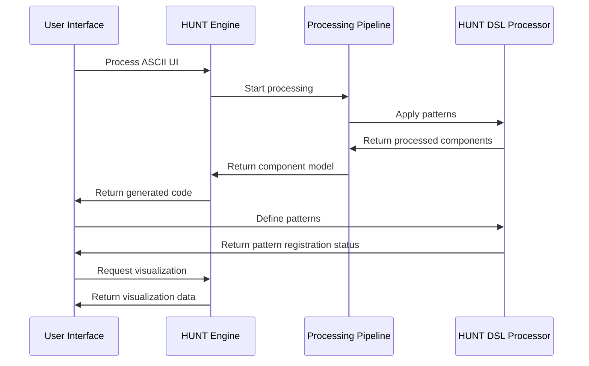
```mermaid
sequenceDiagram
    participant UI as User Interface
    participant Engine as HUNT Engine
    participant Pipeline as Processing Pipeline
    participant DSL as HUNT DSL Processor

    UI->>Engine: Process ASCII UI
    Engine->>Pipeline: Start processing
    Pipeline->>DSL: Apply patterns
    DSL->>Pipeline: Return processed components
    Pipeline->>Engine: Return component model
    Engine->>UI: Return generated code

    UI->>DSL: Define patterns
    DSL->>UI: Return pattern registration status

    UI->>Engine: Request visualization
    Engine->>UI: Return visualization data
```

## 7. Pattern Recognition Architecture

### 7.1 Pattern Detection Process

The pattern detection process involves multiple algorithms working together:

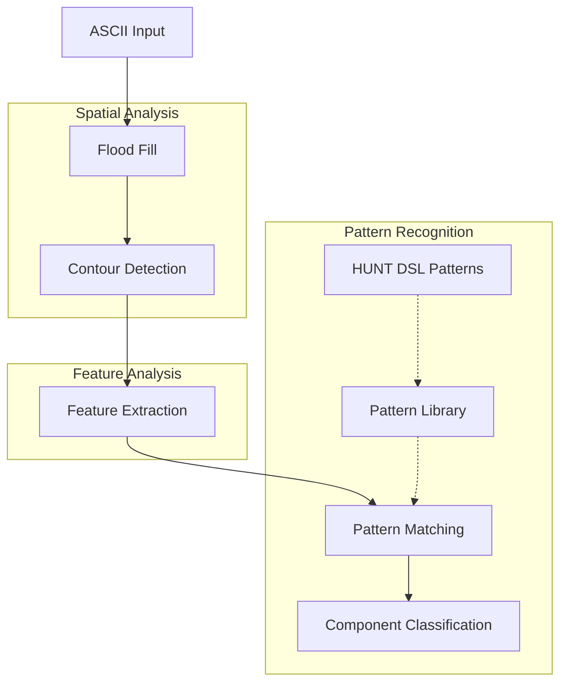
```mermaid
flowchart TD
    A[ASCII Input] --> B[Flood Fill]
    B --> C[Contour Detection]
    C --> D[Feature Extraction]
    D --> E[Pattern Matching]
    E --> F[Component Classification]

    G[Pattern Library] -.-> E
    H[HUNT DSL Patterns] -.-> G

    subgraph "Spatial Analysis"
        B
        C
    end

    subgraph "Feature Analysis"
        D
    end

    subgraph "Pattern Recognition"
        E
        F
        G
        H
    end
```

### 7.2 Pattern Matching Algorithm

The pattern matching algorithm combines multiple techniques:

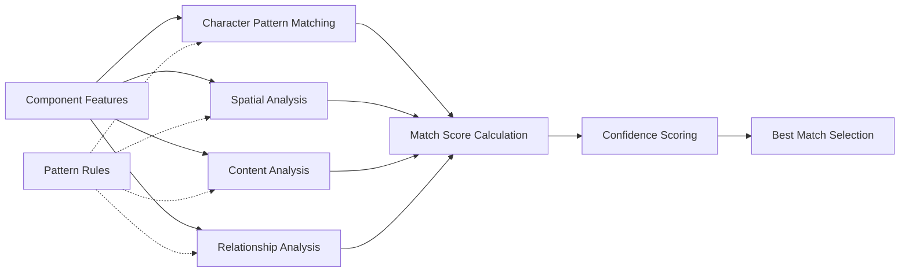
```mermaid
flowchart LR
    A[Component Features] --> B[Character Pattern Matching]
    A --> C[Spatial Analysis]
    A --> D[Content Analysis]
    A --> E[Relationship Analysis]

    B --> F[Match Score Calculation]
    C --> F
    D --> F
    E --> F

    F --> G[Confidence Scoring]
    G --> H[Best Match Selection]

    I[Pattern Rules] -.-> B
    I -.-> C
    I -.-> D
    I -.-> E
```

## 8. Code Generation Architecture

### 8.1 Template-Based Code Generation

The code generation system uses a template-based approach:

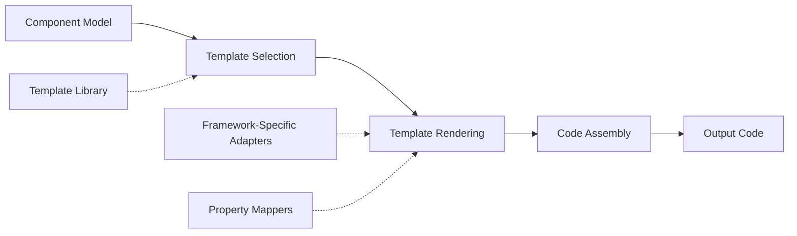
```mermaid
flowchart LR
    A[Component Model] --> B[Template Selection]
    B --> C[Template Rendering]
    C --> D[Code Assembly]
    D --> E[Output Code]

    F[Template Library] -.-> B
    G[Framework-Specific Adapters] -.-> C
    H[Property Mappers] -.-> C
```

### 8.2 Multi-Framework Support

The system supports multiple target frameworks through adapters:

```mermaid
classDiagram
    class CodeGenerator {
        +register_framework_generator(framework: String, generator: Generator)
        +generate(component_model: ComponentModel, framework: String, options: Dict): String
    }

    class FrameworkGenerator {
        +generate(component_model: ComponentModel, options: Dict): String
    }

    class TkinterGenerator {
        +generate(component_model: ComponentModel, options: Dict): String
    }

    class PyQtGenerator {
        +generate(component_model: ComponentModel, options: Dict): String
    }

    class TextualGenerator {
        +generate(component_model: ComponentModel, options: Dict): String
    }

    class TemplateRegistry {
        +register_template(component_type: String, template: Template)
        +get_template(component_type: String): Template
    }

    CodeGenerator -- FrameworkGenerator
    FrameworkGenerator <|-- TkinterGenerator
    FrameworkGenerator <|-- PyQtGenerator
    FrameworkGenerator <|-- TextualGenerator
    FrameworkGenerator -- TemplateRegistry
```

## 9. Extension and Plugin Architecture

### 9.1 Plugin System

The plugin system allows extending the system's capabilities:

```mermaid
classDiagram
    class PluginManager {
        +registerPlugin(pluginId: String, plugin: Plugin)
        +getPlugin(pluginId: String): Plugin
        +loadPluginFromFile(filePath: String): String
    }

    class Plugin {
        +id: String
        +name: String
        +version: String
        +getExtensions(): Dict[String, Any]
    }

    class PatternPlugin {
        +getPatterns(): Pattern[]
    }

    class AlgorithmPlugin {
        +getAlgorithms(): Algorithm[]
    }

    class GeneratorPlugin {
        +getGenerators(): Generator[]
    }

    PluginManager -- Plugin
    Plugin <|-- PatternPlugin
    Plugin <|-- AlgorithmPlugin
    Plugin <|-- GeneratorPlugin
```

### 9.2 Extension Points

The system defines several extension points:

```mermaid
flowchart TD
    A[Extension Registry] --> B[Pattern Extension Point]
    A --> C[Algorithm Extension Point]
    A --> D[Generator Extension Point]
    A --> E[Command Extension Point]

    F[Pattern Plugin] -.-> B
    G[Algorithm Plugin] -.-> C
    H[Generator Plugin] -.-> D
    I[Command Plugin] -.-> E

    B --> J[Pattern Registry]
    C --> K[Algorithm Registry]
    D --> L[Generator Registry]
    E --> M[Command Registry]
```

## 10. Performance and Optimization

### 10.1 Performance Optimization Strategies

The system implements several performance optimization strategies:

```mermaid
flowchart TD
    A[Performance Monitoring] --> B[Runtime Profiling]
    A --> C[Memory Usage Tracking]
    A --> D[Processing Time Measurement]

    E[Optimization Strategies] --> F[Lazy Loading]
    E --> G[Caching]
    E --> H[Parallel Processing]
    E --> I[Algorithm Selection]

    J[Performance Optimizer] --> K[Pipeline Optimization]
    J --> L[Algorithm Tuning]
    J --> M[Memory Management]
    J --> N[Computation Distribution]

    A -.-> J
    E -.-> J
```

### 10.2 Caching System

The system uses a sophisticated caching system for performance:

```mermaid
classDiagram
    class CacheManager {
        +getCache(name: String, createIfMissing: Boolean): Cache
        +clearCache(name: String): void
        +getCacheStats(name: String): Dict
    }

    class LRUCache {
        +maxSize: Int
        +get(key: Any): Any
        +put(key: Any, value: Any): void
        +clear(): void
        +getStats(): Dict
    }

    class PatternMatchCache {
        +cacheMatch(component: Component, pattern: Pattern, match: Match): void
        +getMatch(component: Component, pattern: Pattern): Match
        +invalidate(component: Component): void
    }

    class CodeGenerationCache {
        +cacheCode(component: Component, framework: String, code: String): void
        +getCode(component: Component, framework: String): String
        +invalidate(component: Component): void
    }

    CacheManager -- LRUCache
    LRUCache <|-- PatternMatchCache
    LRUCache <|-- CodeGenerationCache
```

## 11. Deployment Architecture

### 11.1 Package Structure

The system is organized into the following package structure:

```mermaid
flowchart TD
    A[hunt] --> B[hunt.core]
    A --> C[hunt.dsl]
    A --> D[hunt.algorithms]
    A --> E[hunt.components]
    A --> F[hunt.codegen]
    A --> G[hunt.plugins]
    A --> H[hunt.ui]

    B --> B1[hunt.core.grid]
    B --> B2[hunt.core.pipeline]
    B --> B3[hunt.core.model]

    C --> C1[hunt.dsl.parser]
    C --> C2[hunt.dsl.interpreter]
    C --> C3[hunt.dsl.commands]

    D --> D1[hunt.algorithms.floodfill]
    D --> D2[hunt.algorithms.contour]
    D --> D3[hunt.algorithms.classification]
    D --> D4[hunt.algorithms.hierarchy]

    E --> E1[hunt.components.patterns]
    E --> E2[hunt.components.features]
    E --> E3[hunt.components.relationships]

    F --> F1[hunt.codegen.templates]
    F --> F2[hunt.codegen.generators]
    F --> F3[hunt.codegen.adapters]

    G --> G1[hunt.plugins.manager]
    G --> G2[hunt.plugins.extension]
    G --> G3[hunt.plugins.registry]

    H --> H1[hunt.ui.canvas]
    H --> H2[hunt.ui.inspector]
    H --> H3[hunt.ui.preview]
```

### 11.2 Deployment Diagram

The system can be deployed in various configurations:

```mermaid
flowchart TD
    A[Developer Workstation] --> B[HUNT Library]
    A --> C[HUNT CLI]
    A --> D[HUNT GUI]

    E[CI/CD Pipeline] --> B
    E --> C

    F[Production Server] --> B
    F --> G[Web Service]

    H[End User Device] --> D
    H --> G

    B --> I[Python Package Index]
    C --> I
    D --> I
```

## 12. HUNT DSL to Engine Integration Architecture

The HUNT DSL integrates with the core engine through a sophisticated architecture that links pattern definitions to recognition capabilities:

### 12.1 Pattern Definition to Implementation Mapping

```mermaid
flowchart TD
    subgraph "HUNT DSL"
        A1[Pattern Definition]
        A2[Rule Definition]
        A3[Constraint Definition]
        A4[Code Generation Template]
    end

    subgraph "Pattern Translation"
        B1[Pattern Parser]
        B2[Pattern Registry]
        B3[Rule Compiler]
        B4[Template Compiler]
    end

    subgraph "Engine Integration"
        C1[Pattern Matcher]
        C2[Constraint Validator]
        C3[Code Generator]
        C4[Error Handler]
    end

    A1 --> B1
    A2 --> B3
    A3 --> B3
    A4 --> B4

    B1 --> B2
    B3 --> B2
    B4 --> B2

    B2 --> C1
    B2 --> C2
    B2 --> C3
    B2 --> C4
```

### 12.2 Command Execution Flow

```mermaid
sequenceDiagram
    participant User
    participant Interpreter
    participant Registry
    participant Engine
    participant ErrorHandler

    User->>Interpreter: Execute HUNT command
    Interpreter->>Interpreter: Parse command
    Interpreter->>Registry: Lookup command handler
    Registry->>Interpreter: Return handler
    Interpreter->>Engine: Execute command

    alt Success
        Engine->>Interpreter: Return result
        Interpreter->>User: Return result
    else Error
        Engine->>ErrorHandler: Handle error
        ErrorHandler->>Interpreter: Return error handling result
        Interpreter->>User: Return error information
    end
```

### 12.3 DSL Pattern to Engine Component Mapping

```mermaid
erDiagram
    HUNT-PATTERN ||--o{ UI-COMPONENT : "matches"
    HUNT-RULE ||--o{ COMPONENT-FEATURE : "extracts"
    HUNT-TEMPLATE ||--o{ GENERATED-CODE : "produces"

    HUNT-PATTERN {
        string id
        string type
        rule[] rules
        float confidence_threshold
    }

    HUNT-RULE {
        string type
        string target
        string[] values
    }

    HUNT-TEMPLATE {
        string id
        string framework
        string code_template
    }

    UI-COMPONENT {
        string id
        string type
        dictionary properties
        component[] children
        relationship[] relationships
    }

    COMPONENT-FEATURE {
        string name
        any value
        float confidence
    }

    GENERATED-CODE {
        string language
        string framework
        string code
        dictionary metadata
    }
```

## 13. Comprehensive Implementation Architecture

### 13.1 Codebase Structure

The HUNT ASCII UI Translation System codebase is organized into a modular structure that promotes separation of concerns, extensibility, and maintainability. The following diagram illustrates the high-level organization of the codebase:

```mermaid
graph TD
    A[hunt] --> B[hunt/core]
    A --> C[hunt/dsl]
    A --> D[hunt/recognition]
    A --> E[hunt/modeling]
    A --> F[hunt/generation]
    A --> G[hunt/utils]
    A --> H[hunt/plugins]
    A --> I[hunt/ui]

    B --> B1[grid.py]
    B --> B2[pipeline.py]
    B --> B3[component.py]
    B --> B4[persistence.py]

    C --> C1[parser.py]
    C --> C2[interpreter.py]
    C --> C3[commands.py]
    C --> C4[patterns.py]

    D --> D1[floodfill.py]
    D --> D2[contour.py]
    D --> D3[features.py]
    D --> D4[matcher.py]

    E --> E1[model.py]
    E --> E2[hierarchy.py]
    E --> E3[relationships.py]
    E --> E4[layout.py]

    F --> F1[generator.py]
    F --> F2[templates.py]
    F --> F3[adapters/]
    F --> F4[renderers.py]

    G --> G1[logging.py]
    G --> G2[performance.py]
    G --> G3[visualization.py]
    G --> G4[config.py]

    H --> H1[manager.py]
    H --> H2[extension.py]
    H --> H3[registry.py]

    I --> I1[canvas.py]
    I --> I2[inspector.py]
    I --> I3[preview.py]
    I --> I4[app.py]
```

Each module has a specific responsibility within the system:

- **hunt/core**: Contains the fundamental data structures and processing pipeline.
- **hunt/dsl**: Implements the HUNT DSL parser, interpreter, and command system.
- **hunt/recognition**: Implements the algorithms for detecting UI components.
- **hunt/modeling**: Manages the component model and relationship analysis.
- **hunt/generation**: Handles code generation for different frameworks.
- **hunt/utils**: Provides utility functions and common tools.
- **hunt/plugins**: Implements the plugin system for extensibility.
- **hunt/ui**: Contains the user interface components.

### 13.2 Software Design Document (SDD)

#### 13.2.1 System Components and Interactions

The HUNT ASCII UI Translation System consists of several key components that interact to process ASCII UI designs and generate code:

1. **ASCII Grid Processor**: Manages the representation and manipulation of the ASCII text grid.

   - Responsibilities: Grid initialization, character access, region extraction.
   - Interfaces: Provides methods for accessing and modifying grid cells.
   - Dependencies: None.

2. **HUNT DSL Processor**: Parses and interprets HUNT DSL code.

   - Responsibilities: Parsing DSL code, interpreting commands, registering patterns.
   - Interfaces: Provides methods for interpreting DSL code and accessing registered patterns.
   - Dependencies: Pattern Registry, Command Dispatcher.

3. **Pattern Registry**: Stores and manages pattern definitions.

   - Responsibilities: Pattern storage, retrieval, and organization.
   - Interfaces: Provides methods for registering and retrieving patterns.
   - Dependencies: None.

4. **Command Dispatcher**: Routes commands to their handlers.

   - Responsibilities: Command registration, routing, and execution.
   - Interfaces: Provides methods for registering and executing commands.
   - Dependencies: None.

5. **Processing Pipeline**: Coordinates the overall processing flow.

   - Responsibilities: Sequencing processing stages, managing context, handling errors.
   - Interfaces: Provides methods for processing ASCII UI input.
   - Dependencies: All processing stages.

6. **Component Model**: Manages the representation of UI components.

   - Responsibilities: Component storage, relationship management, hierarchy building.
   - Interfaces: Provides methods for adding and querying components and relationships.
   - Dependencies: None.

7. **Code Generator**: Generates code from the component model.
   - Responsibilities: Template selection, rendering, and code composition.
   - Interfaces: Provides methods for generating code for different frameworks.
   - Dependencies: Template Registry, Framework Adapters.

The components interact through well-defined interfaces, with the Processing Pipeline orchestrating the overall flow.

#### 13.2.2 Data Flow and Processing

The data flows through the system in a sequential pipeline with the following stages:

1. **Input Stage**: ASCII UI design is loaded and converted to a grid representation.

   - Input: ASCII text or file.
   - Output: ASCIIGrid object.
   - Processing: Character encoding detection, grid initialization.

2. **Pattern Loading Stage**: HUNT DSL code is processed to define patterns.

   - Input: HUNT DSL code.
   - Output: Registered patterns in the Pattern Registry.
   - Processing: DSL parsing, pattern creation, rule compilation.

3. **Grid Analysis Stage**: The ASCII grid is analyzed to identify regions.

   - Input: ASCIIGrid object.
   - Output: Component candidates with boundaries and content.
   - Processing: Flood fill, contour detection, feature extraction.

4. **Component Recognition Stage**: Component candidates are matched against patterns.

   - Input: Component candidates, Pattern Registry.
   - Output: Classified components with properties.
   - Processing: Pattern matching, feature extraction, classification.

5. **Hierarchical Modeling Stage**: Component relationships and hierarchy are established.

   - Input: Classified components.
   - Output: Component model with relationships.
   - Processing: Containment analysis, relationship detection, layout analysis.

6. **Code Generation Stage**: The component model is transformed into code.

   - Input: Component model, framework selection.
   - Output: Generated code.
   - Processing: Template selection, rendering, code composition.

7. **Output Stage**: The generated code is returned or saved.
   - Input: Generated code.
   - Output: Code file or string.
   - Processing: Formatting, file I/O.

#### 13.2.3 Component Behaviors and States

Each component in the system maintains specific states and exhibits defined behaviors:

1. **ASCIIGrid Component**:

   - States: Grid contents, dimensions, boundary mask.
   - Behaviors: Character access, region extraction, visualization.
   - State Transitions: Initialization → Character updates → Boundary calculation.

2. **HUNT Interpreter Component**:

   - States: Parsing state, execution context, current AST node.
   - Behaviors: DSL parsing, command execution, pattern registration.
   - State Transitions: Parsing → AST generation → Interpretation → Command execution.

3. **Processing Pipeline Component**:

   - States: Current stage, processing context, error state.
   - Behaviors: Stage sequencing, error handling, result aggregation.
   - State Transitions: Initialization → Stage execution → Error handling → Completion.

4. **Component Model Component**:

   - States: Component registry, relationship registry, validation state.
   - Behaviors: Component addition, relationship management, hierarchy building.
   - State Transitions: Initialization → Component addition → Relationship establishment → Validation.

5. **Pattern Matcher Component**:

   - States: Active patterns, matching context, confidence scores.
   - Behaviors: Pattern application, feature extraction, match scoring.
   - State Transitions: Pattern selection → Feature extraction → Rule application → Match calculation.

6. **Code Generator Component**:
   - States: Target framework, template context, generation options.
   - Behaviors: Template selection, rendering, code composition.
   - State Transitions: Framework selection → Template application → Code rendering → Output formatting.

### 13.3 Architecture Decision Record (ADR)

#### 13.3.1 Choice of Pipeline Architecture

**Context**: The system needed an architecture that could process ASCII UI designs through multiple stages of analysis, transformation, and generation.

**Decision**: Adopt a pipeline architecture with distinct processing stages and a shared context.

**Rationale**:

- Clear separation of concerns between processing stages
- Ability to insert, remove, or replace stages without affecting others
- Natural mapping to the logical flow of processing
- Support for incremental processing and partial updates
- Easier testing of individual stages

**Consequences**:

- Each stage must have a well-defined interface
- Stages are sequentially dependent
- Performance bottlenecks in early stages affect the entire pipeline
- Parallel processing requires special handling

#### 13.3.2 Custom DSL for Pattern Definition

**Context**: The system needed a way to define UI component patterns that was both powerful and user-friendly.

**Decision**: Create a custom DSL (HUNT) with a Cabin Brackets Hierarchical System for pattern definition.

**Rationale**:

- Domain-specific syntax tailored to UI pattern recognition
- Hierarchical structure maps naturally to UI component hierarchy
- Clear separation between pattern rules and implementation details
- Extensible command system for future capabilities
- User-friendly syntax for non-programmers

**Consequences**:

- Requires implementation of a custom parser and interpreter
- Learning curve for users unfamiliar with the DSL
- Need for extensive documentation and examples
- Additional layer of abstraction between patterns and implementation

#### 13.3.3 Plugin Architecture for Extensibility

**Context**: The system needed to support extension with new patterns, algorithms, and code generators.

**Decision**: Implement a plugin architecture with well-defined extension points.

**Rationale**:

- Allows adding new capabilities without modifying core code
- Enables community contributions and specialized extensions
- Supports different deployment scenarios and use cases
- Facilitates separation between core system and extensions
- Promotes modular design and loose coupling

**Consequences**:

- More complex architecture with additional indirection
- Need for stable interface contracts for extensions
- Potential performance overhead from dynamic loading
- Requires robust error handling for plugin failures

#### 13.3.4 Template-Based Code Generation

**Context**: The system needed to generate code for multiple UI frameworks from the same component model.

**Decision**: Use a template-based code generation approach with framework-specific adapters.

**Rationale**:

- Clear separation between component model and code generation
- Support for multiple target frameworks with minimal duplication
- Easier maintenance and extension for new frameworks
- Customizable templates for different coding styles and patterns
- More flexibility in generating code structure

**Consequences**:

- Templates must be maintained for each framework
- Potential for template complexity with complex components
- Need for a robust template engine with proper escaping
- Challenge of generating idiomatic code for each framework

### 13.4 System Design - Module Interactions

The HUNT ASCII UI Translation System comprises several interconnected modules that work together to process ASCII UI designs and generate code. The following diagram illustrates the key module interactions:

```mermaid
graph TB
    subgraph "Input Layer"
        A1[ASCII Input Module]
        A2[HUNT DSL Input Module]
        A3[Configuration Module]
    end

    subgraph "Processing Layer"
        B1[Grid Processing Module]
        B2[Pattern Detection Module]
        B3[Component Recognition Module]
        B4[Hierarchy Analysis Module]
        B5[Code Generation Module]
    end

    subgraph "Extension Layer"
        C1[Pattern Plugin Module]
        C2[Algorithm Plugin Module]
        C3[Generator Plugin Module]
        C4[Command Plugin Module]
    end

    subgraph "Utility Layer"
        D1[Logging Module]
        D2[Performance Module]
        D3[Visualization Module]
        D4[Persistence Module]
    end

    A1 --> B1
    A2 --> B2
    A3 --> B1
    A3 --> B2
    A3 --> B3
    A3 --> B4
    A3 --> B5

    B1 --> B2
    B2 --> B3
    B3 --> B4
    B4 --> B5

    C1 --> B2
    C2 --> B1
    C2 --> B2
    C2 --> B3
    C2 --> B4
    C3 --> B5
    C4 --> B2

    D1 -.-> B1
    D1 -.-> B2
    D1 -.-> B3
    D1 -.-> B4
    D1 -.-> B5

    D2 -.-> B1
    D2 -.-> B2
    D2 -.-> B3
    D2 -.-> B4
    D2 -.-> B5

    D3 -.-> B1
    D3 -.-> B2
    D3 -.-> B3
    D3 -.-> B4
    D3 -.-> B5

    D4 -.-> B1
    D4 -.-> B2
    D4 -.-> B3
    D4 -.-> B4
    D4 -.-> B5
```

#### Key Module Interactions:

1. **ASCII Input Module ↔ Grid Processing Module**:

   - The ASCII Input Module provides raw ASCII text to the Grid Processing Module.
   - The Grid Processing Module converts the text into a structured grid representation.

2. **HUNT DSL Input Module ↔ Pattern Detection Module**:

   - The HUNT DSL Input Module provides pattern definitions to the Pattern Detection Module.
   - The Pattern Detection Module registers patterns for later matching.

3. **Grid Processing Module ↔ Pattern Detection Module**:

   - The Grid Processing Module provides processed grid data to the Pattern Detection Module.
   - The Pattern Detection Module applies patterns to identify component candidates.

4. **Pattern Detection Module ↔ Component Recognition Module**:

   - The Pattern Detection Module provides component candidates to the Component Recognition Module.
   - The Component Recognition Module classifies components based on matched patterns.

5. **Component Recognition Module ↔ Hierarchy Analysis Module**:

   - The Component Recognition Module provides classified components to the Hierarchy Analysis Module.
   - The Hierarchy Analysis Module establishes relationships and hierarchy between components.

6. **Hierarchy Analysis Module ↔ Code Generation Module**:

   - The Hierarchy Analysis Module provides a component model to the Code Generation Module.
   - The Code Generation Module transforms the model into framework-specific code.

7. **Extension Modules ↔ Processing Modules**:

   - Plugin modules extend the capabilities of processing modules through well-defined extension points.
   - Processing modules load and utilize extensions through the plugin system.

8. **Utility Modules ↔ Processing Modules**:
   - Utility modules provide cross-cutting concerns like logging, performance monitoring, visualization, and persistence.
   - Processing modules utilize utility modules as needed throughout the pipeline.

### 13.5 Internal Documentation - Detailed System Behavior

#### 13.5.1 ASCII Grid Processing

The ASCII Grid Processing system handles the representation and analysis of the input ASCII text grid:

1. **Initialization**:

   - The system loads the ASCII text and converts it to a 2D grid representation.
   - Character encoding is detected and normalized.
   - Grid dimensions are calculated and stored.

2. **Character Access**:

   - The system provides methods for accessing and modifying grid cells.
   - Boundary checking is performed to prevent out-of-bounds access.
   - Region extraction is supported for operations on sub-grids.

3. **Boundary Detection**:

   - The system identifies boundary characters using pattern matching.
   - A boundary mask is created for efficient boundary checking.
   - Special boundary types (single, double, heavy, rounded) are classified.

4. **Flood Fill Processing**:

   - The system identifies enclosed regions using flood fill.
   - Starting points are selected based on non-boundary characters.
   - Connected regions are tracked and labeled.
   - Component boundaries and content are extracted.

5. **Contour Analysis**:
   - The system analyzes component boundaries to extract shapes.
   - Corner detection identifies component types.
   - Bounding boxes are calculated for spatial analysis.
   - Advanced contour analysis extracts detailed shape information.

#### 13.5.2 HUNT DSL Processing

The HUNT DSL Processing system handles the parsing, interpretation, and execution of HUNT DSL code:

1. **Lexical Analysis**:

   - The system tokenizes HUNT DSL code into a sequence of tokens.
   - Token types are classified based on CBHS bracket types and keywords.
   - Token positions are tracked for error reporting.
   - Comments and whitespace are handled appropriately.

2. **Syntax Parsing**:

   - The system parses the token stream into an abstract syntax tree (AST).
   - CBHS bracket hierarchy is enforced during parsing.
   - Syntax errors are detected and reported with context.
   - AST nodes represent different elements of the DSL syntax.

3. **Semantic Analysis**:

   - The system validates the AST for semantic correctness.
   - Type checking is performed for command parameters.
   - Context resolution links references to their definitions.
   - Semantic errors are detected and reported.

4. **Command Execution**:

   - The system executes commands based on the AST.
   - Command handlers are invoked with appropriate parameters.
   - Execution context is maintained and updated during processing.
   - Results are collected and returned as needed.

5. **Pattern Registration**:
   - The system registers patterns defined in HUNT DSL code.
   - Pattern rules are compiled into executable form.
   - Pattern metadata is extracted for organization and retrieval.
   - Pattern validation ensures correctness and completeness.

#### 13.5.3 Component Recognition

The Component Recognition system identifies and classifies UI components from the processed ASCII grid:

1. **Feature Extraction**:

   - The system extracts features from component candidates.
   - Geometric features capture shape and position.
   - Content features analyze text and special characters.
   - Contextual features consider surrounding elements.

2. **Pattern Matching**:

   - The system matches component features against registered patterns.
   - Pattern rules are applied to evaluate matches.
   - Match confidence is calculated based on rule satisfaction.
   - Multiple pattern matches are ranked by confidence.

3. **Component Classification**:

   - The system classifies components based on best pattern matches.
   - Component types are assigned based on matched patterns.
   - Component properties are extracted from matched features.
   - Classification confidence is recorded for later refinement.

4. **Component Refinement**:

   - The system refines component classifications based on context.
   - Ambiguous classifications are resolved using context.
   - Missing properties are inferred from context.
   - Component consistency is ensured across the UI.

5. **Validation**:
   - The system validates classified components against constraints.
   - Required properties are checked for presence.
   - Property values are validated for correctness.
   - Validation errors are reported for correction.

#### 13.5.4 Hierarchical Modeling

The Hierarchical Modeling system establishes relationships and hierarchy between UI components:

1. **Containment Analysis**:

   - The system analyzes spatial relationships to detect containment.
   - Bounding box calculations determine potential containment.
   - Containment hierarchy is built from outside in.
   - Containment conflicts are resolved using priority rules.

2. **Relationship Detection**:

   - The system identifies functional relationships between components.
   - Label-control relationships link labels to their controls.
   - Action relationships connect buttons to their targets.
   - Logical groups are identified based on function and layout.

3. **Layout Analysis**:

   - The system analyzes component arrangements to detect layouts.
   - Grid arrangements are identified by regular spacing.
   - Flow arrangements are detected by sequential positioning.
   - Alignment relationships are established for related controls.

4. **Hierarchy Building**:

   - The system constructs a component hierarchy based on relationships.
   - Root components are identified as top-level containers.
   - Child components are nested under their parents.
   - Hierarchy depth is optimized for clarity and correctness.

5. **Model Validation**:
   - The system validates the component model for consistency.
   - Circular references are detected and resolved.
   - Orphaned components are identified and reported.
   - Relationship integrity is verified across the model.

#### 13.5.5 Code Generation

The Code Generation system transforms the component model into framework-specific code:

1. **Framework Selection**:

   - The system selects the target framework based on user preferences.
   - Framework-specific adapters are loaded for code generation.
   - Framework capabilities are matched to component requirements.
   - Framework-specific options are applied to the generation process.

2. **Template Selection**:

   - The system selects appropriate templates for each component type.
   - Framework-specific templates are prioritized.
   - Default templates are used for missing component types.
   - Template selection is influenced by component properties.

3. **Template Rendering**:

   - The system renders templates with component data.
   - Component properties are mapped to template variables.
   - Template expressions are evaluated in context.
   - Rendered code is formatted according to style guidelines.

4. **Code Composition**:

   - The system combines rendered component code into a complete program.
   - Component hierarchy determines code structure.
   - Import statements are collected and de-duplicated.
   - Code organization follows framework conventions.

5. **Output Formatting**:
   - The system formats the generated code for readability.
   - Indentation is applied according to language conventions.
   - Comments are added to clarify complex sections.
   - Line breaks are inserted for readability.

## 14. API Specifications

### 14.1 Core API

The HUNT ASCII UI Translation System provides a core API for processing ASCII UI designs:

```python
# High-level API for processing ASCII UI designs
def process_ascii_ui(ascii_text, options=None):
    """Process ASCII UI text and generate code.

    Args:
        ascii_text: The ASCII UI text to process.
        options: Dictionary of processing options.
            - target_framework: The target framework for code generation.
            - patterns: List of HUNT DSL pattern definitions.
            - output_format: Format of the output code (file, string).

    Returns:
        Dictionary containing:
            - success: Boolean indicating success or failure.
            - code: Generated code if successful.
            - component_model: The component model if requested.
            - error: Error message if unsuccessful.
    """

# API for defining and registering patterns
def register_pattern(pattern_code):
    """Register a pattern from HUNT DSL code.

    Args:
        pattern_code: HUNT DSL code defining the pattern.

    Returns:
        Pattern ID if successful, None if unsuccessful.
    """

# API for visualizing component detection
def visualize_detection(ascii_text, options=None):
    """Visualize component detection in ASCII UI text.

    Args:
        ascii_text: The ASCII UI text to process.
        options: Dictionary of visualization options.
            - format: Output format (ascii, html, svg).
            - highlight_components: Whether to highlight detected components.
            - show_confidence: Whether to show confidence scores.

    Returns:
        Visualization in the requested format.
    """
```

### 14.2 Plugin API

The system provides a plugin API for extending functionality:

```python
# API for creating pattern plugins
class PatternPlugin:
    """Base class for pattern plugins."""

    def get_patterns(self):
        """Get patterns provided by this plugin.

        Returns:
            List of Pattern objects.
        """

    def get_info(self):
        """Get plugin information.

        Returns:
            Dictionary containing plugin metadata.
        """

# API for creating algorithm plugins
class AlgorithmPlugin:
    """Base class for algorithm plugins."""

    def get_algorithms(self):
        """Get algorithms provided by this plugin.

        Returns:
            Dictionary mapping algorithm names to implementations.
        """

    def get_info(self):
        """Get plugin information.

        Returns:
            Dictionary containing plugin metadata.
        """

# API for creating generator plugins
class GeneratorPlugin:
    """Base class for generator plugins."""

    def get_generators(self):
        """Get code generators provided by this plugin.

        Returns:
            Dictionary mapping framework names to generator implementations.
        """

    def get_info(self):
        """Get plugin information.

        Returns:
            Dictionary containing plugin metadata.
        """
```

### 14.3 DSL API

The system provides an API for working with the HUNT DSL:

```python
# API for parsing HUNT DSL code
def parse_hunt_dsl(dsl_code):
    """Parse HUNT DSL code into an AST.

    Args:
        dsl_code: HUNT DSL code to parse.

    Returns:
        AST representing the parsed code.
    """

# API for interpreting HUNT DSL code
def interpret_hunt_dsl(dsl_code, context=None):
    """Interpret HUNT DSL code and execute commands.

    Args:
        dsl_code: HUNT DSL code to interpret.
        context: Execution context dictionary.

    Returns:
        Result of interpretation.
    """

# API for generating HUNT DSL code
def generate_hunt_dsl(pattern_data):
    """Generate HUNT DSL code from pattern data.

    Args:
        pattern_data: Pattern data to convert to DSL code.

    Returns:
        HUNT DSL code representing the pattern.
    """
```

## 15. Future Directions

### 15.1 Advanced Pattern Recognition

Future versions of the system will incorporate advanced pattern recognition capabilities:

1. **Machine Learning Integration**:

   - Training models on labeled ASCII UI datasets
   - Feature extraction using neural networks
   - Transfer learning from existing UI recognition systems
   - Active learning for continuous improvement

2. **Context-Aware Pattern Matching**:

   - Considering global UI context for local decisions
   - Learning from user corrections and feedback
   - Adapting to different UI styles and conventions
   - Incorporating domain knowledge into recognition

3. **Pattern Inference**:
   - Automatically generating patterns from examples
   - Refining patterns through usage statistics
   - Detecting common patterns across multiple UIs
   - Suggesting pattern improvements based on matches

### 15.2 Interactive Development Environment

Future development will focus on creating a comprehensive IDE for ASCII UI design and translation:

1. **Real-Time Recognition**:

   - Live component detection while editing
   - Immediate feedback on pattern matches
   - Confidence visualization for ambiguous matches
   - Suggestion system for improving recognition

2. **Pattern Development Tools**:

   - Interactive pattern creation and testing
   - Pattern debugging and refinement tools
   - Pattern library management and organization
   - Pattern sharing and collaboration features

3. **Code Generation Preview**:
   - Live preview of generated code
   - Side-by-side comparison of ASCII and rendered UI
   - Framework switching with instant preview updates
   - Integration with external UI preview tools

### 15.3 Extended Framework Support

The system will be extended to support additional UI frameworks:

1. **Web Frameworks**:

   - HTML/CSS/JavaScript generation
   - React component generation
   - Vue.js component generation
   - Angular component generation

2. **Mobile Frameworks**:

   - Flutter UI generation
   - React Native component generation
   - iOS UIKit/SwiftUI generation
   - Android XML layout generation

3. **Terminal UI Frameworks**:
   - Blessed (Node.js) support
   - Ncurses support
   - Prompt Toolkit support
   - Rich terminal UI support

## 16. Conclusion

The HUNT ASCII UI Translation System provides a comprehensive solution for converting ASCII UI designs into functional code. Through its modular architecture, powerful pattern recognition capabilities, and extensible plugin system, it offers a flexible, efficient, and developer-friendly approach to ASCII UI translation.

Key strengths of the architecture include:

1. **Modular Pipeline Design**: Clear separation of concerns with distinct processing stages.
2. **Powerful DSL**: Custom HUNT DSL with the Cabin Brackets Hierarchical System for intuitive pattern definition.
3. **Extensible Plugin System**: Well-defined extension points for patterns, algorithms, and generators.
4. **Framework-Agnostic Core**: Support for multiple target frameworks through adapters and templates.
5. **Performance Optimization**: Sophisticated caching and optimization strategies for efficient processing.

By implementing this architecture, developers can create a system that effectively bridges the gap between ASCII UI design and functional code, enabling efficient development workflows and leveraging the clarity and simplicity of ASCII UI prototyping.
