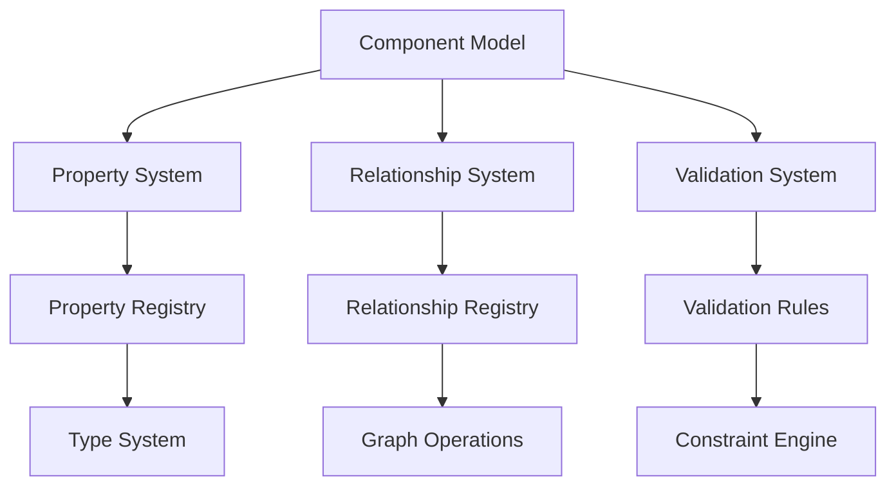
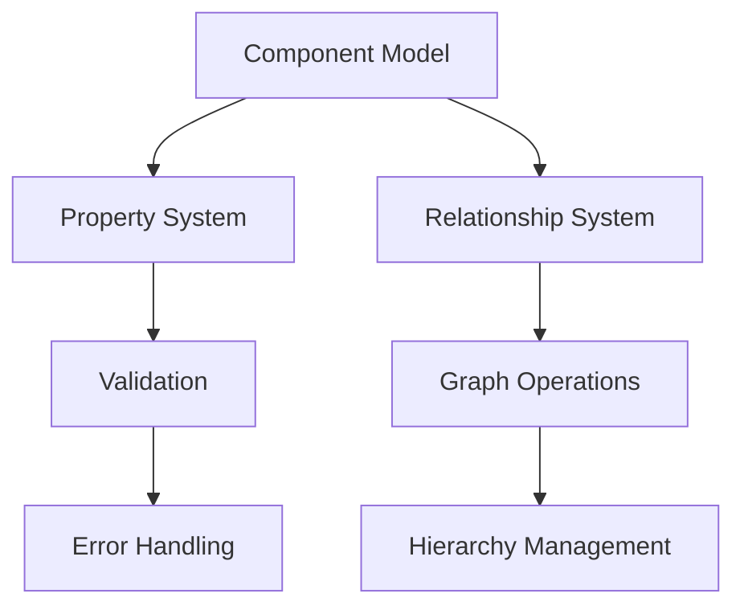
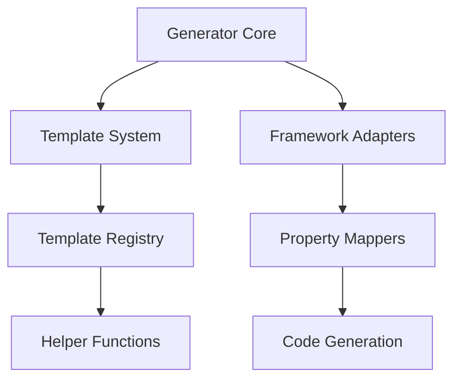
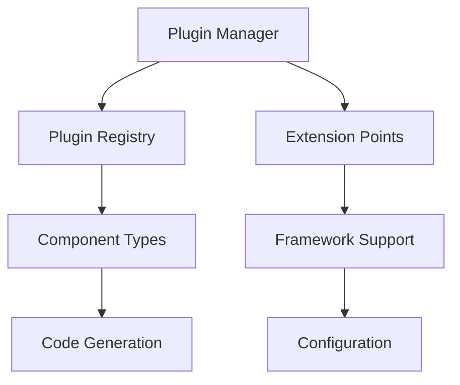

# Algorithm Architecture System Specification

## 1. Abstract Component Model

### 1.1 Core Dependencies



### 1.2 Required External Systems

- Type Registry System
- Graph Processing Engine
- Serialization System
- Validation Engine

### 1.3 Optional Integration Points

- Component Visualization
- Debug System
- State Management
- Event System

## 2. Component Model Implementation

### 2.1 AbstractComponent Class

**Dependencies:**

- Property Management System
- Relationship Manager
- Validation Engine

**Provides:**

- Component Identity
- Property Storage
- Relationship Management
- Hierarchy Support

**Example:**

```python
class AbstractComponent:
    def __init__(self, component_id, component_type):
        self.id = component_id
        self.type = component_type
        self.properties = {}
        self.children = []
        self.parent = None
        self.relationships = []
```

### 2.2 Property System

**Dependencies:**

- Type Registry
- Validation Rules
- Event System

**Provides:**

- Property Definition
- Value Validation
- Change Notification

**Example:**

```python
COMPONENT_PROPERTIES = {
    'Window': {
        'required': ['title', 'width', 'height'],
        'optional': ['minimizable', 'maximizable', 'closable'],
        'defaults': {
            'minimizable': True,
            'maximizable': True,
            'closable': True
        }
    }
}
```

### 2.3 Relationship System

**Dependencies:**

- Graph Operations
- Component Registry
- Event System

**Provides:**

- Relationship Types
- Hierarchy Management
- Graph Operations

## 3. Code Generation System

### 3.1 Generator Core

**Dependencies:**

- Template Engine
- Component Model
- Framework Adapters

**Provides:**

- Code Generation
- Template Management
- Framework Integration

### 3.2 Template System

**Dependencies:**

- Template Registry
- Helper Functions
- Framework Specifics

**Provides:**

- Template Definition
- Code Rendering
- Helper Integration

### 3.3 Framework Adapters

**Dependencies:**

- Framework Registry
- Property Mappers
- Code Generator

**Provides:**

- Framework Support
- Property Mapping
- Code Customization

## 4. Plugin Architecture

### 4.1 Plugin Manager

**Dependencies:**

- Plugin Registry
- Component Types
- Generators

**Provides:**

- Plugin Registration
- Component Support
- Generator Management

### 4.2 Plugin Interface

**Dependencies:**

- Core System
- Extension Points
- Configuration System

**Provides:**

- Standard Interface
- Extension Support
- Configuration Management

### 4.3 Framework Plugins

**Dependencies:**

- Plugin System
- Framework Support
- Code Generation

**Provides:**

- Framework Integration
- Component Support
- Code Generation

## 5. DSL System

### 5.1 Parser Core

**Dependencies:**

- Lexical Analyzer
- Grammar Rules
- AST Generator

**Provides:**

- DSL Parsing
- AST Generation
- Error Handling

### 5.2 Mapping System

**Dependencies:**

- Component Model
- Template Engine
- Expression Evaluator

**Provides:**

- Component Mapping
- Property Mapping
- Code Generation

### 5.3 Template Engine

**Dependencies:**

- Expression Parser
- Data Context
- Helper Functions

**Provides:**

- Template Rendering
- Expression Evaluation
- Context Management

## 6. Integration Points

### 6.1 Component Integration



### 6.2 Generator Integration



### 6.3 Plugin Integration



## 7. System Validation

### 7.1 Component Validation

- Type Checking
- Property Validation
- Relationship Integrity

### 7.2 Generator Validation

- Template Validation
- Code Generation Verification
- Framework Compatibility

### 7.3 Plugin Validation

- Plugin Interface Compliance
- Extension Point Validation
- Configuration Validation

## 8. Error Handling

### 8.1 Component Errors

- Property Validation Errors
- Relationship Errors
- Type Errors

### 8.2 Generator Errors

- Template Errors
- Code Generation Errors
- Framework Errors

### 8.3 Plugin Errors

- Loading Errors
- Configuration Errors
- Extension Errors

## 9. Performance Considerations

### 9.1 Component Performance

- Property Access Optimization
- Relationship Caching
- Hierarchy Operations

### 9.2 Generator Performance

- Template Caching
- Code Generation Optimization
- Framework Optimization

### 9.3 Plugin Performance

- Plugin Loading
- Extension Point Optimization
- Configuration Caching
